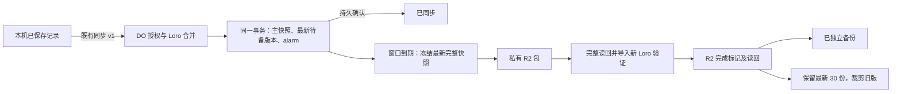

# Hako 独立备份方案分析

初稿日期：2026-10-03；二次审查：2026-10-04（Asia/Shanghai）。**状态：设计已确认、二次审查通过，可进入本地实施；未实现、未部署、未创建 R2，尚不能宣称可以恢复生产数据。** 用户最新授权为二次 review 通过后使用指定 Anby Agent Role 新开 session 实施。原父会话继续统筹交付；本分析会话完成审查、无真实数据的本地探针、文档修订与实施派发。Git 发布、云端操作和真实数据操作仍不在本次实施授权中。

> **2026-10-04 实施状态：本稿的设计已由独立实施会话（Anby）在隔离 worktree 完成本地实现与 workerd 集成验收（未提交、未部署、未创建真实 R2）。**此后规则的唯一权威来源是：产品取舍→[重新设计记录·备份与恢复](../specs/redesign.md#备份与恢复)；技术合同→[独立备份合同](../specs/backup.md)；工程建议→[整体架构第 7 节](../specs/architecture-proposal.md#7-备份与恢复)；实施与验证证据→[本地验证进展](../local-validation.md#独立备份切片2026-10-04隔离-worktree未提交未部署)。本稿保留为设计依据与二次审查记录，不再重复维护规则。

## 已确认设计与实施边界

已选方案沿用现有账号 Durable Object，采用**同步优先、最新待备版本可以合并、已经冻结的上传版本不可改变**的机制。同步事务同时持久保存主快照、递增的服务端版本和备份责任；DO alarm 冻结待备的最新完整 Loro 快照，写入私有 R2 Standard，完整读回并导入独立 Loro 实例验证后，发布不可变的完成标记。保留最近 30 个完成版本；成功发布新版后才裁剪旧版，无变化不增版，不按天过期。

首版只增加一个 R2 资源及现有 DO 内的少量状态，不增加 DO namespace、Queues、Workflows、Cron 或外部常驻服务。正常时从第一项待备变化起算固定 30 秒窗口，不随后续编辑顺延；失败时退避重试并合并尚未冻结的版本。DO 中最多保留一个冻结快照，其他变化由主文档和持久游标承接，避免无限排队。R2 上传或删除故障不会因为待备数量增加而主动暂停同步；DO 自身写入失败仍然不能确认同步成功。

**2026-10-03 用户确认：**用户在审阅详细方案、计费边界、正常及故障操作频率后回复“OK，那就按你这个设计”，确认上面的同步优先方案，以及固定 30 秒窗口、故障期间合并未冻结版本、裁剪故障延后新备份但继续同步的取舍。重试采用第 4 节的退避节奏；第 5、6 节明确未触发裁剪时不做整套保留集合核查，64 次 B 类操作只是保守预算，新备份仍须完整读回验证。本次只记录确认和最小导航，不将设计写成已部署合同。

前稿的“每个服务端提交都冻结一份，积压满后拒绝新同步”没有被采用。父会话曾建议同步优先，本次确认依据是用户上述回复；旧方案仅在第 4 节保留作取舍对照。

这个方案假定同一 Cloudflare 账号中的 R2 仍可访问、所需版本尚在保留集合内。如果账号整体失去访问权，或有权限的代码同时破坏 DO 与 R2，本方案不能保证恢复。它提供独立于同步主库的副本，故障域仍属于同一平台和账号。

| 原有已确认产品方向 | 本次已确认设计 |
| --- | --- |
| 本人一个账号、首版一辆车、local-first、前台联网同步 | 按服务端历史推进检测变化；一次备份可覆盖多个服务端提交，同一离线批次不拆成多个文件 |
| 按变化备份、允许短时间合并、最近 30 份、无变化不新增、不按天过期 | 固定 30 秒窗口；故障期间合并未冻结版本，不保证每个中间提交各有文件；首次基线计入 30 份 |
| 仅 Cloudflare，优先免费和低维护，不新增端到端加密 | 私有 R2 Standard、DO 持久任务和单个 alarm；完整快照加独立完成标记 |
| 未同步唯一副本、草稿、旧验证库有独立边界 | 一个冻结任务＋一个最新待备游标；裁剪失败最多暂留 31 份，延后新备份，但继续同步 |
| 本次以备份为主，完整恢复可以另开 PR | 提供格式、验证器和最小状态接口；恢复 UI、恢复写入及文档换代协议留给恢复 PR |

保留数量、部署平台、隐私方向，以及**备份故障期间合并未冻结版本以保持同步可用**均已确定，不再重复询问。R2 开通状态、共享额度和正式名称留到发布准备核实；这些平台事实未因设计确认而成为已验证事实。

费用结论：按每月 20–200 份、每份 1–4 MiB 的明确假设，新增使用量预计可落在免费额度内，无需为了一个备份功能默认升级 Workers Paid；前提是账号共享额度足够。R2 超额按单位进位、DO 活跃时长、失败重试和日志均需计入。第 6 节给出计算及超额示例，不能把“预计免费”写成承诺。

当前沿用 Workers Free，待其他项目实际接入后结合账号总用量评估升级。用户已表示计费问题解决；本轮没有查询实际账单或剩余额度，也没有变更订阅。

## 1. 证据基线与权威来源

本任务 worktree 初始 HEAD 为 `e3d44d9d413d80376c9502431c72d5ea3b379138`，当时干净。本轮用操作级绑定且通过 GitHub `/user` 验证为 `LoTwT` 的同一凭据，只读核实远端 `main` 为 `c73effa1e2ba708ed5fd7aec80376f819e6cc5fa`，取得该提交并仅快进本任务分支。其 tree 为 `69d2c85d113341ab997ca6940197c4add05cc8c1`。主检出的 `main` 仍为原来的 `e3d44d9`，未移动主检出或使用其他任务的未提交资料。

`c73effa` 相对运行源码候选 `e2d6bd0dd033b085f5f4c6f1eb37dcf5b173288c` 的差异均为文档；本轮确认的是仓库基线，没有重新核实 Cloudflare 线上状态。既有 deployment、version、100% 流量及其观测时间仅引用[发布与真实协作验收归档](../releases/2026-10-03-sync.md)，不延长其证据有效时间，也不恢复缺失原件。

权威分工：

- 产品边界：[重新设计／备份与恢复](../specs/redesign.md#备份与恢复)及[同步冲突与修改历史](../specs/redesign.md#同步冲突与修改历史)。
- 已部署账号、存储、限额与确认语义：[账号同步合同](../specs/account-sync.md)。
- 身份、Cookie、续期和 owner：[登录合同](../specs/eruoo-login-integration.md#61-本应用会话与-owner-配置)。
- 旧工程建议：[整体架构第 7 节](../specs/architecture-proposal.md#7-备份与恢复)。其中的 30 秒合并窗口、备份状态随同步返回、文档代次切换均不是已实现合同。本稿已确认固定 30 秒窗口、独立读取备份状态和故障合并；备份 PR 将据此更新工程建议，并将新增产品取舍归入原产品决策来源、建立正式备份合同，避免长期重复维护同一规则。本分析稿在交接期间记录确认依据，不改变已部署账号同步合同。
- 最新验收与操作边界：[发布归档](../releases/2026-10-03-sync.md)、[验收分析摘录](./2026-10-03-real-device-acceptance.md)。既有验收已经结束；本轮没有访问旧浏览器、profile、真实会话、账号数据或剩余验收额度。

已核实的实现入口：

| 源码 | 对本方案有约束的事实 |
| --- | --- |
| [account-durable-object.ts](../../src/worker/account-durable-object.ts)、[account-sync.ts](../../src/worker/sync/account-sync.ts) | `HakoAccountDurableObject` 的同步调用在授权、合并、续期之间不异步让出；之后 `await storage.sync()`。当前没有 alarm 或备份逻辑 |
| [account-documents.ts](../../src/worker/sync/account-documents.ts) | 固定账号 DO 中分开存 `account_data_ids` 和 `refueling_snapshots`；业务快照按 512 KiB 分块，在 `transactionSync` 内原子替换，版本相同不重写 |
| [sync-document.ts](../../src/data/sync-document.ts)、[refueling-document.ts](../../src/data/refueling-document.ts) | 完整 snapshot、历史根与原始容器校验；当前业务只有 `records` Map，没有已实现的车辆根、模式根或 epoch 根 |
| [sync-protocol.ts](../../src/shared/sync-protocol.ts)、[routes.ts](../../src/worker/sync/routes.ts) | 协议 1、4 MiB 请求及合并后上限、同源授权和账号匹配；成功正文是已持久保存的完整快照，未带备份确认 |
| [cloudflare.config.ts](../../cloudflare.config.ts)、[package.json](../../package.json)、[锁文件](../../pnpm-lock.yaml) | 唯一配置入口、兼容日期 `2026-10-01`、既有日志与 traces；锁定 Loro 1.16.3、cf 1.0.0-beta.10 和 Cloudflare Vite 插件 beta 路线 |

## 2. 备份什么，以及“变化”是什么

### 权威版本与内容边界

权威源是 **DO 验证、合并后已持久保存的完整业务文档**。同步事务记录“当前还有哪个版本需要备份”；窗口到期且没有冻结任务／未完成裁剪时，alarm 在短事务内读取当时的主快照与版本，冻结为一个具体上传任务。冻结后只使用这些字节，不能后来换成最新主库内容却沿用旧任务标识。不直接备份 HTTP 上传正文，也不从任一浏览器读取。

每版保留完整 Loro snapshot：记录 ID、合同内的字段和单位、PeerID／操作 ID／因果关系、历史操作及删除历史。备份是历史载体的独立文件；不重新创建 PeerID、不从当前 JSON 反建文档、不使用 shallow snapshot、不另存可写业务 JSON。字段定义引用现有验证器和业务合同，不在备份格式中复制一套字段清单。[Loro 持久化](https://www.loro.dev/docs/tutorial/persistence)、[导出模式](https://www.loro.dev/docs/tutorial/encoding)。

外层只增加可识别、核验与归属所需的业务文档元数据。**不导出整个 DO SQLite**：其中存在身份映射、登录事务、会话与凭据哈希。备份不包含 issuer/owner subject 映射、Token、verifier、Secret、Cookie、浏览器认证资料、草稿、截图、本机确认游标或本机旧库导入映射。当前车辆等尚未实现的数据不能被列为已覆盖。

最近 30 份限制的是独立快照数量；每份完整快照可能仍包含更早的业务历史。因此裁剪旧备份不等于清除 Loro 历史，也不代表撤回曾经保存的字段值。

### 版本判定

在同一账号及当前文档空间中，比较合并前后 **OpLog 的版本向量**。相同表示没有新增已保存操作；严格推进表示新的服务端历史版本，需要更新备份责任，但不等于立即生成一个备份文件。版本向量通过 PeerID 与计数的规范表示比较，不靠对象引用、JSON 属性顺序、日期、字节哈希或记录数量判等。工作副本必须处于附着的最新状态，`version()` 与 `oplogVersion()` 相等；历史浏览的 detached 状态不能作为服务端当前版本。

版本向量描述已知操作集合；DocState 可在 checkout 时落后于 OpLog。因此“当前值相同”和“历史相同”不能混用。[版本向量](https://www.loro.dev/docs/concepts/version_vector)、[OpLog 与 DocState](https://www.loro.dev/docs/concepts/oplog_docstate)。

| 事件 | 版本与备份责任 |
| --- | --- |
| 已同步的新增、编辑、导入；将来支持的删除 | 历史推进时服务端序号加一，并更新最新待备版本 |
| 相同值的无操作保存 | 没有新 Loro 操作则不增加；不能仅依据点击“保存”计数 |
| 新并发操作被 LWW 隐藏，当前字段不变 | 更新待备版本，因为可追溯历史变化了 |
| A → B → A 分两次到达服务端并提交 | 两次历史推进；若合并到一份备份，完整历史仍有中间操作，但没有两份独立文件的保证 |
| 重复同步、确认丢失后的重试、上传旧子集 | 合并历史不推进，不增加；仍可补齐已有任务的确认 |
| 轮询、登录、会话续期、备份重试、库重新编码但操作集合不变 | 不增加 |
| 设备离线保存多次，之后一次上传完整历史 | 一个服务端提交版本，保留该批次全部历史；不能声称每次本机保存都有独立备份对象 |
| 非法／超限快照、主库或备份责任入库失败 | 整体不提交，不增加，不确认同步 |

**已确认的合并语义：**第一次未覆盖变化到来时确定 `dueAt = firstDirtyAt + 30 秒`；后续变化只更新最新版本，不后移 `dueAt`。到期时冻结最新版本。这样不会因持续编辑而无限延后第一次捕获。窗口是调度目标，不是 30 秒内完成备份的 SLA；R2 耗时、已有任务和故障退避都会延长实际延迟。

例：V10 已有独立备份，V11、V12 在同一窗口内提交，冻结 V12；上传 V12 时又提交 V13、V14，后面只需冻结 V14。若 R2 故障，先保留并完成已经冻结的 V12，再备份故障恢复时的最新版本。V11、V13 的操作保留在后续完整历史里，但不承诺有对应文件或每次服务端合并时点的独立恢复点；只记录合并区间也不能重建每个时点的精确 frontiers。

因此，“最近 30 版”具体指最近 30 **份完成并验证的独立备份**，不是最近 30 次保存或同步。正常短时间合并符合现有产品方向；将合并延伸到长时间故障期间已随本次设计获用户确认，实施时须如实反映在正式备份合同中。

## 3. 格式、标识与独立索引

### 每版两个不可变对象

推荐一个二进制包和一个很小的完成标记；避免可变 `latest.json` 成为唯一索引。以下均是**提议的新结构**：

- 前缀：`hako-backup/layout-v1/<environment>/accounts/<accountId>/refueling/<backupStreamId>/`。
- 包：`objects/<20位补零revision>-<bundleSha256>.hakobak`。
- 完成标记：`commits/<20位补零revision>.json`。

`backupStreamId` 是首次初始化持久生成的随机 UUID，用于区分备份序列；它**不是已部署同步协议中的文档 epoch**。`revision` 是该冻结快照对应的服务端历史序号，作为十进制字符串输出；同步提交失败不消耗序号，备份重试复用原序号。合并会造成文件序号跳号，这是正常行为，不能凭缺号判定丢失。排序以序号为准，时间仅供查看。`backupId` 为 stream 与 revision 组成的唯一标识；账号、环境和文档类型共同约束前缀。

当前一个账号只有一个活动序列。首次接入该环境的 R2 时还要检查已有账号／序列前缀，不能因为新生成了 accountId 就把已有桶当成空桶。每次开始或恢复 R2 生命周期时都核对已完成的最大序号，包括继续冻结任务、保留检查和裁剪重试，不能只在新任务首次上传时检查。新任务序号只能高于已完成最大序号，或是同一任务内容完全一致的重试；R2 出现超出本地已确认／冻结任务所能解释的更大版本时应阻塞，不得恢复旧裁剪计划或复用已被裁剪的旧序号。发现未知归属／序列、序号倒退或冲突完成标记时，停止自动发布／裁剪并报告异常，不能按时间猜测归并。DO 被回退或元数据丢失后由受控恢复处理；后续恢复 PR 必须定义序列衔接及跨代次的全账号最近 30 版，不能悄悄变成每个代次各 30 版。

二进制包采用：8 字节 ASCII 标记 `HAKOBK1\n`，4 字节大端无符号 manifest 字节数，UTF-8 JSON manifest，再接原始 snapshot。manifest 上限 16 KiB，snapshot 上限沿用当前 4 MiB；包长必须精确匹配，无额外尾随数据。首版不套 Base64 或自定义压缩。

| manifest 必需信息 | 推荐值或含义 |
| --- | --- |
| `format`、`formatVersion` | `hako-independent-backup`、`1`；与 Loro 库版本、同步协议及业务 schema 分开 |
| `environment`、`accountId`、`documentType` | 环境名、已有随机账号 UUID、`refueling`；账号 UUID 不是访问凭证 |
| `sourceGeneration` | 明确标记 `{ kind: legacy-account-v1, id: accountId }`；描述当前账号绑定的文档空间，不伪造已存在的 epoch |
| `backupStreamId`、`revision`、`reason` | 持久序列、序号、`baseline` 或 `history-change` |
| `capturedAt`、`sourceCommittedAt` | DO 冻结时及该源版本持久提交时的 UTC 时间；启用前基线没有已知服务端提交时间时，后者为 null，不猜测历史时间 |
| `previousCompletedRevision`、`firstPendingRevision` | 冻结时已完成版本及本次合并区间起点，允许为空；仅解释覆盖区间，不保证区间内逐提交恢复点 |
| `businessSchema`、`syncProtocol`、`loroVersion` | `hako-refueling-records-v1`、`1`、`1.16.3`；schema 名称描述已有验证器，不往 Loro 内新增根 |
| `snapshotMode`、`snapshotBytes`、`snapshotSha256` | `snapshot`、精确长度、原始快照 SHA-256 |
| `historyVersionSha256`、`recordCount` | 从快照重新计算的版本向量摘要、当前记录数量；不额外保存可写业务投影 |

版本向量摘要规范固定为：PeerID 以无前导零十进制字符串表示，按其整数值排序；计数也编码为十进制字符串；对无空白 UTF-8 JSON 二元组数组做 SHA-256。不能把 64 位 PeerID 转成 JavaScript `number`。完整向量和 frontiers 已在快照中，无需再把可能很大的向量塞进对象 metadata。

manifest 按固定字段顺序序列化，任务的捕获时间、版本和 schema 一旦入库便固定。SHA-256 计算可以在 alarm 中针对冻结字节执行；R2 操作前把准备结果持久化，重试不得重新取时间或换编码。整个二进制包再计算 `bundleSha256`，用于对象键、R2 上传校验和完成标记。

完成标记上限 4 KiB，仅包含格式版本、backupId、归属、包的精确键、字节数和 `bundleSha256`；不包含可变“当前时间”。它在包读回验证之后才可创建。包内 manifest 是业务元数据来源，完成标记是经过验证的索引引用；交叉检查两者一致。R2 custom metadata 只用于诊断，不作为唯一恢复信息。

包与标记均使用条件创建：已存在就读取并核对，不能无条件覆盖。同键内容不同是冲突，不自动换个 key 伪装重试成功。Worker R2 API 支持条件写入、SHA-256 上传校验及强一致读回；ETag 不作为 Hako 的内容哈希。[Workers R2 API](https://developers.cloudflare.com/r2/api/workers/workers-api-reference/)、[一致性模型](https://developers.cloudflare.com/r2/reference/consistency/)。

按 Workers API 的实际返回合同处理条件失败：`put()` 返回 `null` 不代表本次写入成功，须读取原对象核对；带条件的 `get()` 可能返回没有 `body` 的对象，不能当成已经读到内容。读取前检查对象长度，按包／标记各自上限限制缓冲；不能先无界 `arrayBuffer()` 再验证长度。内部验证器拒绝超长、截断、未知格式和不符合当前账号／环境／序列的输入。

### 可用性验证

每版发布完成标记前，必须从 R2 **重新 GET 整个包**，依次校验长度、整体 SHA-256、magic／格式、manifest 归属、快照长度和 SHA-256，再调用 Loro 内置校验并导入全新的文档，应用现有原始容器和业务字段验证，核对完整历史、无 pending 操作、最新状态、版本摘要和记录数量。最后条件创建并读回完成标记，核对其确定内容。

这证明该备份在验证时可读、可解析且与捕获版本一致；不是恢复到生产应用的证明。SHA-256 防止意外损坏和对象混淆，不证明能抵抗同时修改对象及校验信息的账号管理员。未来读取仍要重新验证，不能只相信过去的成功日志。

## 4. 提交、触发与失败处理

### 持久状态与两个事务边界

| 状态 | 保存什么 | 大小与责任 |
| --- | --- | --- |
| 既有主快照 | 当前已合并完整历史 | 原有限额 4 MiB；待备最新版本的权威内容 |
| 备份游标 | stream、当前 revision／提交时间、最新完成 revision／历史摘要、首次待备时间、窗口到期时间、重试时间与次数 | 固定数量的小型状态；多个待备提交合并更新这一行，不逐提交存任务或复制完整版本向量 |
| 唯一冻结任务及分块 | 确定 revision、时间、manifest 输入、完整快照、阶段和已确定的包哈希 | 原始快照最多 4 MiB，512 KiB 分块；冻结后不得替换内容 |
| 完成缓存、保留检查责任与精确裁剪计划 | 已验证对象键／哈希、待保留检查的完成 revision、当前一个旧版的删除阶段 | 常态最多 30 份缓存，发布过程中 31 份；不是恢复唯一索引 |

**同步事务**：授权、账号匹配、输入校验、Loro 合并、主快照切换、revision 及待备责任更新一并提交，需要唤醒时同时安排 alarm。没有新历史时不增加 revision、不改窗口、不写出新备份。不能先确认主库，再依靠 `waitUntil()` 补 dirty 标记。R2 失败不参与这个事务。

**捕获事务**：alarm 确认没有已有冻结任务及未完成裁剪后，在同一短事务内读取主快照及其 revision，创建唯一冻结任务并持久安排下一次安全唤醒。随后离开事务，才做哈希、R2 和独立导入验证。捕获后发生的新同步更新新的待备责任，不改冻结快照。

这两个边界保证：已确认的服务端变化一定留有“必须最终备份到至少此历史版本”的责任；已经对 R2 发出操作的任务有稳定身份及原始字节。合并未冻结版本是显式的产品语义，不是漏记任务。主库与待备责任一起丢失时，只有已完成的 R2 版本能兜底。

需要把事务所有权调整到 DO 存储适配层，保留同步授权到业务写入之间的无 `await` 段。在 `storage.transaction()` 内可以执行 SQL 并安排 alarm，事务中只等待 DO storage，不等待 R2。`transactionSync()` 不能容纳异步 `setAlarm()`；SQLite 的异步事务涵盖 `ctx.storage` 上的 SQL／存储操作。现有 `AccountSync.exchange` 会捕获部分失败，必须先让外层事务完整回滚，再映射回既有失败响应。提交后继续 `await storage.sync()`，不改变协议 1 的持久确认语义。[SQLite 事务与 sync](https://developers.cloudflare.com/durable-objects/api/sqlite-storage-api/#other)。

SQL 与 alarm 的共同回滚、退出授权时序、输出门、测试适配器的事务所有权及重启行为均为实施 PR 的必测门禁。二次审查已用锁文件版本的独立 workerd 合成探针验证 SQL／alarm 联合回滚和跨进程持久读取，结果见第 10 节；该 API 语义验证不替代最终 Hako 实现的集成验收。

### 单个 alarm 的工作顺序

1. 先检查持久阶段和到期时间。已有冻结任务优先继续原任务；已完成但保留检查／裁剪尚未收尾时先继续收尾；这些责任都没有才在窗口到期时捕获最新主文档。一个 handler 只推进一个版本的有界生命周期，避免在持续编辑下无限循环。
2. 每次 R2 尝试前持久增加尝试计数并安排安全重试。网络等待不持有覆盖整次上传的 `blockConcurrencyWhile`；新的同步可以推进主库。一次只有一个 R2 发布者，状态接口不触发上传。
3. PUT 包 → GET 全包验证 → 条件创建完成标记 → GET 标记核对 → DO 确认完成并释放冻结字节。该完成事务必须同时持久登记本 revision 的“保留检查待完成”责任并保留必要 alarm，即使尚未 LIST、尚不知道是否需要裁剪也一样；只有检查及必要删除全部完成后才清除这项责任。完成事务只清除自己覆盖的备份责任：如果当前 revision 已推进，保留后续待备状态与原始到期时间，不能无条件清空 dirty。
4. 可重试错误按 1、5、15、60 分钟退避，之后每小时重试。新编辑不能把故障重试重新提到立即执行，也不能重置失败次数形成请求风暴。成功后重读最新状态，若还有到期的待备变化，安排下一次捕获；无待备／裁剪工作就停止调度。
5. 归属、未知格式、哈希或同键冲突进入 `blocked`；保留任务、旧备份和最新待备游标，停止自动 R2 操作，等待修复。该状态本身不拒绝正常有效的同步。构造及正常调用中的调度自检不得偷偷解除 `blocked`。

Cloudflare 的 alarm 为至少一次执行，同一 DO 的 alarm handler 不并行；异常自动重试最多 6 次。持久的阶段和 `nextAttemptAt` 必须使重复／过早的 alarm 只检查并重新安排，不重复上传。主动安排下一次 alarm 才能覆盖更长的下游故障；不能只依赖平台的 6 次重试。[Alarms API](https://developers.cloudflare.com/durable-objects/api/alarms/)。官方 [alarm 示例](https://developers.cloudflare.com/durable-objects/examples/alarms-api/)提供存储加唤醒的基本模式，但不能照搬 `deleteAll()` 清理本项目共用认证 DO。

所有 R2 调用都等待结果，不用未取消的 `Promise.race` 留下后台上传后启动下一版。写入结果未知先查询确定 key；同内容补确认，不同内容阻塞。重启恢复后仅依据持久任务推进；已完成或已裁剪的旧任务不能重新上传。待备、重试和清理共用一个 alarm，根据阶段选择时间，不能最后用过期的“队列为空”判断取消并发提交新设的唤醒。

首版构造函数只做幂等建表，不通过“`getAlarm() === null`”自行初始化备份或重新计时。运行中的 alarm 也可能读到 `null`，因此调度由上述持久阶段及事务决定；只读状态请求不触发调度修复。清理责任结清和下一次 alarm 的计算在同一短事务中重新读取最新待备状态，避免 R2 等待期间到达的新同步被覆盖。[alarm 的运行与构造边界](https://developers.cloudflare.com/durable-objects/api/alarms/#getalarm)。

### 失败和确认边界

| 中断／失败点 | 行为 |
| --- | --- |
| 主快照、责任行或必要 alarm 写失败 | 同步事务回滚，返回既有同步失败；设备保留本机数据 |
| DO 已提交，同步响应丢失 | 客户端重试同一历史不增版；待备责任仍在 |
| 到期前关闭客户端／断网 | 已同步变化由服务器 alarm 处理；尚未同步的本机内容不在覆盖内 |
| 冻结后又提交新历史 | 当前任务字节不变；新历史合并到最新待备责任 |
| R2 包写成功但确认丢失 | 按相同 key 读回核验；不生成第二份、不换 revision |
| 包存在，验证或标记发布失败 | 不算完成，不裁剪旧版；重试同一阶段 |
| 完成标记已存在，DO 完成确认丢失 | 重新验证标记及包，补记原 revision |
| DO 已确认完成，但尚未列清单／登记具体裁剪计划就重启 | 持久的保留检查责任仍在，先完成检查／裁剪，不捕获或发布下一版 |
| 标记完成后主库仍有更新 | “最近一次备份成功”为真，“当前服务端版本已备份”为假 |
| R2 持续不可用或旧版删除失败 | 保留当前冻结任务／裁剪计划和一个最新待备游标；正常同步继续，独立备份落后时间增长 |
| DO 主库与未完成责任同时丢失 | 只保证可以发现已完成的 R2 备份候选，不能保证未完成窗口 |

“已同步”只意味着主库和备份责任持久化；“已独立备份”需要 R2 内容及完成标记均读回验证。两种确认不得合并为一个成功状态。

### 为什么选择合并待备，而不是逐版排队

最小方案是“持久 dirty 标记＋alarm 读最新主库”。本稿在此基础上仅增加一个冻结任务，解决上传途中主库改变、写入成功但确认丢失、版本身份无法重现的问题。

| 方案 | 取舍 |
| --- | --- |
| 同步请求直接 await R2 | 组件少，但把同步延迟／可用性绑到 R2；仍需解决跨存储失败，不推荐 |
| **最新待备游标＋唯一冻结任务＋alarm** | 同步优先、存量固定；牺牲逐提交独立文件保证，已确认采用 |
| 每次提交都冻结＋有界队列 | 可保证逐服务端提交文件；达到 128 份／128 MiB 后必须拒绝新历史或改变保证。前稿的该上限只是备选工程值，不是产品合同 |
| 新增 Queues／Workflows／周期扫库 | 仍需 DO 到外部服务的可靠交付；单账号没有足够收益抵消接线和运维，不纳入首版 |

在当前 4 MiB 限制下，主快照和唯一冻结副本的原始业务字节合计最多约 8 MiB，其中备份新增至多 4 MiB，另计表、索引、页与小型状态。不会因故障天数累积 128 份完整副本。该存储界限不代表 Loro 展开后的内存用量也只有 8 MiB；CPU／内存必须另测。

## 5. 最近 30 版、并发与首次启用

### 可用集合与裁剪顺序

可用候选必须具有内容一致的 R2 完成标记和包。DO 中的完成表是调度缓存，不能成为恢复必需的唯一清单。通过账号／文档前缀列出 `commits/` 即可发现候选，严格处理分页，不能把没有标记的包计入可用集合；R2 强一致单次操作不等于跨对象事务或多页列表快照。

单个 alarm 发布新版后，枚举并核对完成清单，以 revision 保留最新 30 版。没有超过 30 版、也没有未完成裁剪计划时，不执行整套旧版保留集合的 GET／HEAD 核查；本次新增版本仍须按第 3 节完整读回验证。确需裁剪时，删除之前先确认待保留对象仍存在、长度及已存哈希与完成标记相符；对变化或可疑对象重新完整验证。验证不足、未知格式或冲突时停止裁剪并保留旧版。可复用先前对同一不可变对象的导入验证，不需要每次把 30 个文档全部展开到内存；复用不省略删除前必要的存在性和一致性检查，也不使 DO 缓存成为唯一恢复清单。

超出的旧版先在 DO 中持久登记精确裁剪计划，再删除该版的完成标记，最后删除包，最后结清计划。这样不会留下“清单宣称可用，但包已被本程序删除”的窗口；中断可能留下没有标记的旧包，由原计划继续清理。删除响应丢失时重查同一精确 key，确认不存在即可；不扩大成按前缀批量清空。

每次从中断／退避中恢复裁剪，都先重新检查 R2 序列与待保留集合；旧计划的验证结果不能无限期充当本次删除依据。发现外部更高序号、保留对象缺失／冲突或未知对象时，暂停破坏性操作并保留尚存对象。保留检查责任只有在集合已满足最近 30 份且没有本任务未结清的残留删除时才能结清；即使有新同步到达，也不得提前捕获下一份。这补齐“完成确认与创建裁剪计划之间崩溃”造成超过 31 份的窗口。

首版将裁剪收尾也放在同一串行生命周期内：裁剪失败时新版依然已完成，状态显示 `cleanup_pending`；先完成清理，再捕获／发布下一版。正常从 30 份开始，算法最多暂留 31 份包及对应标记；删除标记成功、删包失败时，候选已回到 30 份，还有一个已登记残留包。没有未知外部对象时，原始快照最多临时占 124 MiB。冻结任务不存在时不为最新待备游标提前上传额外对象。

**删除持续失败会延迟后续备份，但不会因积压阻塞同步。**后续同步只更新最新主文档和待备游标；清理恢复后捕获最新版本。这个选择同时控制存量与实现复杂度，代价是独立备份的新鲜程度下降。另一选择是删除失败时继续无限发布，会突破按数量保留的目标并扩大费用；本稿不推荐，也不暗中采用。状态必须分别报告上传、清理及当前版本覆盖情况，不能用“已有 31 份”掩盖新变化尚未备份。

恢复读取和裁剪可交错：读者根据 backupId 读取完整包并验证后持有有界字节副本。若选择后该版本已被裁剪，返回明确的“版本已退出保留集合”，重新列清单；不能静默改读最新版本。已获取的字节不依赖对象继续存在。将来有多步恢复预览／确认时，恢复 PR 须增加选择版本的保留约束，不能仅持有一个随时可能过期的 key。

这里的删除流程只是设计。**本轮及本稿本身均不授权任何真实 bucket/object 删除。** 后续授权仅应覆盖算法算出的确切超额版本和本任务已登记的残留对象。未知孤立对象保留并报告，不自动猜测其归属或价值。

### 初始化与边界情况

| 场景 | 推荐处理 |
| --- | --- |
| 部署后账号尚未调用正常同步 | 不宣称已有备份；状态为未初始化。发布不会自动唤醒休眠 DO，本方案也不加周期扫库 |
| 首次正常授权同步，已有业务快照 | 在同一提交中把启用前快照冻结为唯一基线任务；若该次输入推进历史，同时留下新版本的待备责任。先完成基线，再备份最新，避免合并掉启用前状态 |
| 只有账号映射，尚无服务端文档 | 不凭映射创造业务快照；首次成功持久保存文档时捕获一版，包括合法完整空快照 |
| 已持久保存的空快照 | 首次作为基线捕获一次；之后空副本轮询不新增。记录数为 0 但有删除／修改历史的版本仍是有效变化 |
| 服务端已有损坏或超限文档 | 保留原文档和已有 R2 对象，报告阻塞；不自动修复、不截断历史或制造“空备份” |
| 单次 incoming／merged 超过 4 MiB | 继续既有协议拒绝与本机保留行为；备份不绕过同步限额 |
| DO 磁盘／日写入额度不足 | 新的联合提交失败，无同步成功确认；同步优先不能绕过主存储故障，已有责任保留，恢复后重试 |
| 编码／业务 schema 升级 | 升级本身不消耗新业务版本；后续变化使用新格式。保留旧版解码器和测试样本，不原地改写备份；不认识的格式保留并阻止不安全裁剪 |
| 备份表丢失、DO PITR 或命名空间被替换 | 检测序列不一致后停止自动写入／裁剪；通过 R2 自描述清单做受控重建，不能自动把一个新序列当成空账号 |

首次基线是“未捕获 → 已捕获”的一次启用动作，不伪造历史每次保存对应的备份时间。它含启用前仍存在于主文档的全部 Loro 历史，但不能补回已丢失的操作或过去不存在的独立备份文件。首次上线验收应安排一次明确授权的正常同步来触发基线；不能用带 Cookie 的 session 请求冒充只读初始化探针。

## 6. R2 接线、状态与费用

### 接线建议

设计使用绑定名 **`HAKO_BACKUPS`**、候选 production bucket 名 **`hako-backups-production`**。真实资源名称与可用性在发布准备时核实，本轮没有查询其存在性或创建它们。只在 `cloudflare.config.ts` 的既有 worker env 中通过 `bindings.r2` 声明，明确 `name`，本地 `dev.remote` 设为 `false`。本地使用隔离的合成 R2 存储；若发布准备需要线上合成验证，另用明确命名的测试 bucket／Worker，不能以同桶前缀替代环境隔离。

本轮从发布包核对 `cf@1.0.0-beta.10` 及其 `@cloudflare/config@0.22.0` 的类型和 schema，二者 tarball SHA-512 均与仓库锁文件一致：`bindings.r2` 支持 `name`、`jurisdiction`、`dev.remote`。没有安装或升级项目依赖、运行部署或换用 Wrangler。官方配置仍标为 beta，后续以锁定版本的类型、构建输出和 dry-run 为发布依据。[cf 配置](https://developers.cloudflare.com/cf/projects/cloudflare-config/)、[cf 官方源码](https://github.com/cloudflare/cf)。

保持 bucket 私有，关闭 `r2.dev` 和自定义域名公开访问，不配置面向浏览器的 CORS、公开下载链接或持久 S3 Key。运行时通过唯一 bucket binding 访问，无需新增 Secret。现有 Cloudflare 部署身份届时需要该账号相应 R2 管理／读取权限；不能由本分析推断已经具备。R2 默认私有并提供平台静态加密，但绑定不是“只能向某前缀追加”的权限：Hako 代码拥有桶对象操作能力，必须按精确对象限制裁剪。[公开访问控制](https://developers.cloudflare.com/r2/buckets/public-buckets/)、[数据安全](https://developers.cloudflare.com/r2/reference/data-security/)。

不依赖 S3 Bucket Versioning 自动完成 30 版策略，当前官方兼容表仍列 `PutBucketVersioning` 未实现；独立 key 与 Hako 自己的完成清单承担版本语义。[S3 API 兼容表](https://developers.cloudflare.com/r2/api/s3/api/)。不设置按天 lifecycle、不启用与自动裁剪相冲突的 bucket lock；将来若要求不可变防勒索保护，应另行讨论与按数删除的冲突。

### 最小可观察状态

推荐备份 PR 提供一个只读元数据接口 `GET /api/backups/refueling/status`，不调整现有同步响应或 UI。它使用既有本人会话校验，并通过**只查已有映射**取得账号；无映射时返回未初始化，不调用会创建映射的 `resolveAccountId`。响应 `no-store`，不续期、不写 Cookie、不初始化备份、不上传数据。

状态包含：是否初始化、当前源 revision、冻结任务 revision／字节、最新完成 revision、待备合并区间与首次时间、下次尝试时间、固定错误码、清理待完成数量，以及“当前服务端版本是否已有已验证备份”。区分 `pending`、`uploading`、`retrying`、`cleanup_pending`、`blocked`、`current_backed_up`；它们是服务器元数据，不要求本 PR 增加状态 UI。覆盖判断只针对读取时的 DO 版本，不覆盖设备离线修改；认证身份不从 query／accountId 参数取得。

“当前服务端版本已备份”要核对当前业务版本与完成版本的历史摘要，不能只看任务表里的两个序号相等，以免旧代码回退期间漏捕获的变化被误报成功。

日志记录捕获／重试／完成／裁剪失败事件、backupId、大小、耗时及错误码；不记录 snapshot、字段值、真实身份、Cookie 或请求正文。复用现有日志和 traces，不逐条业务记录打日志，无新增第三方监控服务。完成标记及持久任务是事实，日志可采样且会过期，不能用日志代替任务或恢复清单。状态读取只读 DO 元数据及必要的业务版本核对，不每次 LIST R2；不加定时状态轮询。

本 PR 的内容读取能力由内部 R2 读取验证函数和本地合成验收提供。公开的备份列表、下载及恢复 API 留给恢复 PR；有 Cloudflare 管理权限的恢复操作者可从私有 R2 取得包，再用同一格式验证器核验，即使业务 DO 已不可用。

### 计费口径：区分已有成本、增量和共享额度

以下资料于 **2026-10-03** 再核对；R2 价格页更新于 10-01，DO 于 09-30，Workers 于 10-02。没有查询真实账号套餐、账单、R2 subscription 或剩余额度。表内为美元公开价，税费、汇率、域名和既有应用开销另计。

| 费用项 | 免费／包含额度 | 超出后的口径 |
| --- | --- | --- |
| R2 Standard | 每月 10 GB-month、100 万 A 类、1,000 万 B 类 | $0.015/GB-month、$4.50/百万 A、$0.36/百万 B；按单位向上取整。直接出站及删除免费。[R2 价格](https://developers.cloudflare.com/r2/pricing/) |
| DO 计算，Workers Free | 10 万请求/日，13,000 GB-s/日 | Free 超限会失败，不能当成自动按量续用；alarm 也计请求 |
| DO 计算，Workers Paid | 100 万请求/月，400,000 GB-s/月 | 超额 $0.15/百万请求、$12.50/百万 GB-s；超额用量先按计费单位进位。[DO 价格](https://developers.cloudflare.com/durable-objects/platform/pricing/) |
| SQLite DO，Free | 读 500 万行/日、写 10 万行/日、账号总存储 5 GB | 达限相关操作失败；每次 setAlarm、行删除也计写入 |
| SQLite DO，Paid | 读 250 亿行/月、写 5,000 万行/月、5 GB-month | 超额读 $0.001/百万行、写 $1/百万行、存储 $0.20/GB-month；不要套用旧 KV 后端每 4 KB 计一次的规则。[存储计费](https://developers.cloudflare.com/durable-objects/platform/pricing/#sqlite-storage-backend) |
| 入口 Worker | Free 10 万动态请求/日、每次 10 ms CPU | Paid 为账号最低 $5/月，含 1,000 万请求及 3,000 万 CPU ms/月；超额分别 $0.30/百万请求、$0.02/百万 CPU ms。[Workers 价格](https://developers.cloudflare.com/workers/platform/pricing/) |

复用已有 DO 不新增一个固定月租实例。Workers Paid 的 $5 是账号套餐费用，不是每个 DO 或每个 bucket 各收 $5；已付费账号在有包含额度时，也不因接入本功能再增加一份 $5。R2 有独立订阅／结算流程，**开通 R2 不等于本方案必须升级 Workers Paid**。[R2 开始使用](https://developers.cloudflare.com/r2/get-started/)。

应计算的增量是“账号原用量加 Hako 备份后的账单”减去“账号原用量的账单”，不能把共享免费额度重复分配给每个项目或测试环境。现有登录、前台同步和 API 流量是基础负载；本方案新增 alarm、少量 SQL、R2 和观测事件，不新增浏览器轮询或外部 Cron 请求。Worker 向 R2 发起的绑定调用不另算入口请求，但 R2 的操作计量依然存在。

### DO 的 duration 到底怎么算

DO 计算量按分配的 128 MB，即价目示例采用的 **0.128 GB × 活跃秒数**计算。活跃时长包含等待 R2 I/O 的时间；同一个 DO 内重叠请求的活跃时段只算一次，不把每个并发请求的持续时间简单相加。[DO 计算计费](https://developers.cloudflare.com/durable-objects/platform/pricing/#compute-billing)。

持久设置一个 30 秒后或 1 小时后的 alarm，然后结束 handler，允许 DO 进入可休眠状态；这段纯等待不是一直运行的付费任务。不能用 `setInterval`／长期 `setTimeout`／悬挂 Promise 保持活跃。无变化且没有未完成工作时不设新 alarm，只有已有存储继续占用容量。[DO 生命周期](https://developers.cloudflare.com/durable-objects/concepts/durable-object-lifecycle/)。

因此完整读回校验虽然多一次 GET 和验证工作，在个人负载下远小于额度；不应为了省这一点用量削弱备份证据。实际 CPU、内存和 I/O 耗时仍需在 workerd 测量，5 秒这样的估值不是性能承诺。

### 正常负载测算

假设：一个账号、30 天为计算周期、每月完成 N 份备份、每份原始快照 S MiB、保留 30 份。这里 N 是**合并后实际生成的文件数**，不是点击保存次数；20 与 200 均为模型输入，没有读取真实记录大小或使用频率。

每份保守预算 **4 次 A 类、64 次 B 类**：两次 PUT（包与标记）、最多两次正常 LIST，以及完整读回、标记读取、核对最多 30 份保留对象等；正常清单很小，不跨多个列表页。DELETE 免费。重试、异常目录、多页列表、人工下载另计。用这一预算比只数一次 PUT 更接近完整设计；最终实际调用数须由合成集成测试核对。

64 次 B 类是包含裁剪前核查的保守测算，不是每份备份固定执行的目标。未触发裁剪时跳过整套保留集合核查，复用已验证的不可变对象信息；仍保留新包和完成标记的独立读回，以及实际删除前的必要检查。按当前个人使用模型，整体操作量少、触发频率适中，单次完整保留核查偏保守；实施以实测调用数及耗时确认，不为减少少量调用增加新的缓存服务或周期巡检。

| 月度负载 | 20 份 × 1 MiB | 200 份 × 1 MiB | 200 份 × 4 MiB |
| --- | --- | --- | --- |
| 常态原始快照存量 | 30 MiB | 30 MiB | 120 MiB |
| 含最大格式开销的临时峰值估计 | 约 0.034 GB | 约 0.034 GB | 约 0.131 GB |
| R2 A 类/月 | 80 | 800 | 800 |
| R2 B 类/月 | 1,280 | 12,800 | 12,800 |
| 每份活跃 5 秒时的 DO 计算/月 | 12.8 GB-s | 128 GB-s | 128 GB-s；大包实际耗时待测 |
| 免费额度充足时的预计增量费用 | $0 | $0 | $0 |

峰值按 31 份包，每份 snapshot 外最多 16 KiB manifest、12 字节头及 4 KiB 标记估算；R2 存储费按各日峰值的月平均，不是上传总流量。4 MiB 档约占 10 GB 免费存储的 1.31%，不是 30 × 当月上传次数份无限累积。

DO 只新增最多一个 4 MiB 原始冻结副本和小型状态。当前 4 MiB 快照最多分 8 块；捕获、释放分块、维护索引、游标和 alarm 都计入 SQLite 读写。不能按“一次保存一条加油记录”推算只有一行写入。举例，即使每份备份新增读、写各 200 行，200 份也各约 4 万行/月，但这是粗略预算，Free 额度是**按日**的，集中一天与分散一个月不同。服务端推进次数若大于文件数，还要加上每次更新游标的开销；原有同步写入不能漏算。

实施时用 `SqlStorageCursor.rowsRead`／`rowsWritten` 实测，并单独记录 alarm 等未包含在 SQL cursor 中的操作；不能把粗估直接称为平台账单。[SQLite 游标计量](https://developers.cloudflare.com/durable-objects/api/sqlite-storage-api/#exec)。

### 一个月备份持续失败会怎样

用于压力估算：退避进入每小时一次，取 **750 次 R2 尝试/月**，包含起初几次较密的重试余量。这不是平台保证的调用上界；重复 alarm、人工干预和异常代码要由测试与状态计数识别。

| 假设 | 额外用量 |
| --- | --- |
| 每次都用完整预算 4 A、64 B | 3,000 A、48,000 B/月，仍远低于 R2 免费额度 |
| 每次活跃 5 秒就发现失败 | 480 GB-s/月，平均约 16 GB-s/日 |
| 每次拖到 alarm 的 15 分钟时限 | 86,400 GB-s/月，平均约 2,880 GB-s/日 |
| 长时间没有写成功 | 没有新完成版本；旧的 30 份保留，DO 只保留一个冻结任务和最新待备责任 |

15 分钟依据 [DO alarm 执行时限](https://developers.cloudflare.com/durable-objects/platform/limits/#wall-time-limits-by-invocation-type)。这个压力算例说明，在单账号前提下，**恢复点迟迟不更新通常比重试费用更值得关注**。它不能证明任意一天的全部账号用量都不超限，也不能覆盖错误代码形成的无限调用。

新数据不能绕过退避触发额外 R2 尝试；已知格式／归属冲突直接阻塞自动 R2 操作，避免每小时重复处理一个注定失败的包。备份状态仍保留供排查。没有变化时也可能存在旧的失败任务，不能因为当前没有新编辑就取消其重试。

### 何时真的会收费

| 情形 | 预算含义 |
| --- | --- |
| Workers Free，R2 与 DO 共享额度充足 | 典型模型预计新增 $0；Free DO 超限主要表现为操作失败 |
| 已有 Workers Paid，包含额度充足 | 原有账号至少 $5/月继续存在，备份预计新增 $0；不能说整个账号账单为零 |
| 为本功能特意从 Free 升 Paid | 新增至少 $5/月；目前没有仅凭备份负载就升级的依据，先验证容量／CPU |
| 其他应用恰好耗尽 R2 各项免费额度 | 少量新增也可能跨入一个计费单位：A 为 $4.50、B 为 $0.36、存储为 $0.015；三项都跨界的示例合计约 $4.88，而不是几厘钱 |
| Paid DO 其他应用已耗尽 400,000 GB-s | 再增加少量活跃时间也可能进入一个 $12.50/百万 GB-s 的计费单位；不能按 12.8 GB-s 直接乘小数单价承诺账单 |

最后两行是**共享账户位于台阶边缘的示例**，不是每月固定收费，也不是总费用上限；如果已在同一计费档，少量增加可能不改变账单。R2、DO 分别依照各自官方进位规则估算，不能把一个产品的规则套给所有费用项。

### 日志、费用提醒与无需新增的设施

现有配置已开启 logs 和 traces。当前 [Workers Logs](https://developers.cloudflare.com/workers/observability/logs/workers-logs/)列 Free 每日 20 万事件、保留 3 天；Paid 每月 2,000 万事件，超额 $0.60/百万、保留 7 天。R2 调用也可产生自动 trace span，不应只数手写的几条日志。[Workers Traces](https://developers.cloudflare.com/workers/observability/traces/)的默认采样为 100%；本任务不静默修改已有全站采样设置。

官方已公布 **2026-12-01** 切换到统一 [Observability 计价](https://developers.cloudflare.com/observability/pricing/)：Free 0.5 GB/日并含 7 天保留；Paid 每周期含 50 GB 摄入、12 GB-month 存储，超额分别 $0.25/GB、$0.10/GB-month。故不能把早期 tracing 免费视为永久合同。发布在该日期之后时须按新口径复核。本方案只记录少量元数据，不新增 R2 Data Access Logs、日志导出、外部监控或常驻计费查询服务。

费用控制优先靠结构：私有 bucket、没有公开上传／列表入口、无变化不运行、固定窗口、单个上传者、持久退避、最多 31 份过渡存量，以及与真实环境分离的合成验证。正常本地探针不产生 Cloudflare 用量；线上验收须在发布单限制资源与操作数。

发布准备时查看账号 Billable Usage 和套餐，可建议由本人设置 $1 的用量费用提醒以尽早发现偏差；不在本轮创建提醒或通知收件人。Cloudflare [Budget alerts](https://developers.cloudflare.com/billing/manage/budget-alerts/)是账号级提醒，**不会暂停服务或封顶费用**。本方案没有实时掌握整个账号其他应用的用量，因此也不提供“绝对不收费”的自动保证。

### 容量与接线限制

R2 的单次 PUT 上限为 5 GiB，key 为 1,024 字节、对象 metadata 为 8,192 字节；本方案的约 4 MiB 包无需 multipart，manifest 放包体内。同 key 写入最多每秒一次，确定 key 的重试仍须退避。[R2 限额](https://developers.cloudflare.com/r2/platform/limits/)。Standard 具有免费额度且无最短保留期；Infrequent Access 不享受该免费额度、存在取回费与 30 天最短存储期，不适合此小容量按版本轮换的方案。

DO Free 的单实例存储上限在官方 FAQ 中为 1 GB，账号总量 5 GB；通用表的 10 GB 不应误当 Free 上限。备份使用同一认证 DO，CPU、128 MB 内存、连接和 SQL 行大小均需尊重；顺序或有界并发核验，不能一口气展开 30 份历史。4 MiB 是**当前同步合同**的限制，完整历史随使用增长会先触及它；不能以 R2 能存大文件为由直接提高同步上限或截断历史。[DO 限额](https://developers.cloudflare.com/durable-objects/platform/limits/)。

## 7. 可以应对的故障与恢复 PR 的最小合同

| 故障 | 本方案提供什么 | 限制 |
| --- | --- | --- |
| 浏览器站点数据被清理 | 已独立备份版本仍在 R2；正常情况下已有同步副本也可重建本机 | 本机唯一未同步记录、草稿和旧验证库不在其中 |
| 错误编辑／将来误删，随后已同步 | 可读取仍保留的旧版完整文档和历史 | 没有恢复 UI；超过保留集合且历史亦不可读时无保证 |
| DO 业务表损坏或丢失，R2 完好 | R2 完成标记和包可独立枚举、验证、导入空文档 | 仍需恢复身份映射／目标文档空间，不能自动认领账号 |
| R2 短暂不可用、写后断联、DO 重启 | 冻结任务保留，确定 key 和阶段检查可重试 | 完成前存在 RPO 窗口，不能把“已同步”称作“已独立备份” |
| 同账号整体丢失、封禁，平台整体故障，管理员同时删除两份 | 无跨账号／跨云承诺 | 本轮不新增外部备份或密钥恢复系统 |

未来恢复不能只是清空 `refueling_snapshots` 再导入旧快照：现有协议 1 会继续合并旧设备完整历史，可能重新引入恢复点之后的编辑／删除。仅执行 Loro checkout 也只是历史浏览。[已部署同步版本边界](../specs/account-sync.md#同步接口协议-v2)、[Loro 时间旅行](https://www.loro.dev/docs/tutorial/time_travel)。

本次必须固定：包格式及验证规则、完整历史、随机账号归属、legacy 文档空间描述、schema／库／协议版本分离、稳定 backupId、完成标记的意义、相同版本幂等与错误类型。新旧格式不得只靠文件扩展名或当前值外观判断。

恢复 PR 负责以下完整合同，本轮不实现也不提前修改已部署协议：

1. 恢复前保存当前状态，验证选定备份并在预览期间保护其保留资格；把普通字段历史纠正与整文档灾难恢复分开。字段纠正产生正常的新编辑，整文档恢复需要换代。
2. 为账号文档增加服务端掌握的 `documentGeneration`，扩展同步协商／请求和客户端本地命名空间。整文档恢复切换到新 generation；旧 generation 及不携 generation 的旧 v1 客户端被明确拒绝，不能把缺失值解释成“当前代”。
3. 客户端切代先冻结旧副本，保留旧未同步修改及草稿，重新获取新代文档；不得拿旧库套上新 generation 再上传。草稿引用、旧库导入去重和本机确认版本一并审阅，避免自动回灌。
4. 定义跨代次备份序列与最近 30 版的衔接、恢复中断／重复确认、设备升级门禁、身份映射丢失后的受控归属绑定，以及完整端到端验收。备份的 `accountId` 只是来源标签，不能代替当前本人授权。

目前无需让每个客户端提前携带一个虚假的 epoch。保存清楚的 legacy 来源，足以让将来的恢复迁移知道必须隔离哪类旧副本。

## 8. 独立备份 PR 边界和验收

### 一个可独立交付的 PR

包含：最新待备游标与唯一冻结任务的增量建表、DO 事务和 alarm 接线、固定窗口与故障退避、R2 包与完成标记、验证器、最近 30 版裁剪、只读状态接口、脱敏日志、私有 R2 配置、针对性测试及正式备份合同。保留已有账号 DO 类／namespace／实例及身份表，采用增量 schema，不复制认证库。

预计涉及 10–14 个实现／测试／文档文件及一个新 R2 资源：核心改动在 `src/worker/sync/account-documents.ts`、`account-sync.ts`、`src/worker/account-durable-object.ts`；新增集中于 `src/worker/backup/`，路由接线与配置少量修改，复用 `src/data/sync-document.ts` 验证。现有 SQLite 测试适配器需匹配事务边界；不为此重构认证模块。

不包含：恢复 UI／实际恢复写入／epoch 协议落地、AI、统计、通用导入、历史查看 UI、同步状态 UI 调整、原生分发、端到端加密、依赖升级、eruoo 改动、老验证库迁移或生产数据整理。公开列表／下载接口及多步恢复会话也不在本 PR。

另有发布协调事项：当前 `App.vue` 与 `RefuelingWorkspace.vue` 各有一条“独立备份尚未接入”的静态事实说明。按本轮限制不在此设计 UI 改动；父会话在决定上线时需安排这两处事实文案与实际交付状态对齐，不能把它们改成无条件的“已备份”，也不借此扩大为同步状态 UI 优化。

### 必要的本地合成验证

| 类别 | 必须证明的结果 |
| --- | --- |
| 新增、编辑、并发、回到原值 | 每次服务端历史推进都更新持久备份责任；被 LWW 隐藏的新操作不漏，离线一批按一次提交计算 |
| 合并窗口 | V1、V2 同窗只冻结 V2；继续编辑不能无限顺延窗口；两个窗口分别完成时有两份；无变化不增版 |
| 幂等与冻结 | 轮询、重复／旧快照、请求或响应乱序不增版；重试不生成新 key；V1 已冻结后 V2 到来，V1 字节保持不变，V2 责任仍在 |
| SQLite 与 alarm 原子性 | 分别在主分块、冻结分块、游标、setAlarm、持久确认处注入失败；不存在同步成功却漏掉持久责任／必要唤醒的状态；重启后结果一致 |
| R2 各阶段 | PUT 未发生、写成功但抛错、条件 PUT 返回 null、条件 GET 无 body、GET 失败、超长／损坏包、标记创建失败、标记成功但 DO 确认丢失；阶段可恢复且没有假完成 |
| 长期故障 | 超过平台 6 次重试仍有持久调度；前台关闭后继续；连续提交超过前稿 128 版仍能同步，只有一个冻结副本和最新待备游标；恢复后先完成冻结版，再捕获最新版本，完整历史仍在 |
| 30 版与裁剪 | 跨窗口完成至少 31 份真实不同的备份；在完成确认后、首次 LIST 前、具体裁剪计划写入前分别中断，重启均先收尾且不出现第 32 份；失败新版不裁剪，裁剪各步中断不损坏保留集合；重试时复核保留集合，DO 回退后不得执行落后的裁剪计划；持续删失败不再增对象但同步继续；修复后追上最新；无按天到期 |
| 读取并发 | 读取与新增／裁剪交错，只返回指定版的验证内容或明确已退出集合；分页／未知对象不会造成漏计和扩大删除 |
| 初始化与格式 | 已有账号文档、无文档、真正空快照、空投影但有历史、未知 schema／损坏／同键冲突、字节限额边界均有明确结果 |
| 隔离与授权 | 合成 A/B 账号和不同环境不能互读；身份／会话／草稿不进入包；状态 GET 不建映射、不续期、不写 Cookie；既有同步授权与原子性回归仍通过 |
| 用量与故障退避 | 无变化且无未完任务时不再调用 R2；未触发裁剪时不做整套保留集合核查，新包完整验证及实际裁剪前检查仍保留；新编辑不重置失败退避；记录正常／重试 A/B 次数、SQL 行数及耗时；统计包含校验、裁剪与 traces，不把测算当实测 |
| **独立可读取性** | 完成上传后移除本地合成主库与 DO 清单，仅用本地 R2 的完成标记定位包；读取字节、校验、导入全新 Loro 文档，逐字段比较当前记录，并 checkout 已知历史点比较旧值。至少覆盖空文档、有历史、并发及接近 4 MiB |

最后一行是可恢复性证据的最低要求；PUT 返回成功、只 HEAD 看对象存在、只比较记录数均不够。该验证只导入隔离文档，不提供正式恢复操作，不触及真实账号或浏览器。

复用 `pnpm run test`、`pnpm run typecheck`、`pnpm run build` 和 `pnpm exec cf deploy --prebuilt --dry-run --mode production`。原子性和 alarm／R2 集成要在本地 workerd 与隔离持久存储下执行，不能只用 Node SQLite 或 mocked R2；先核对全部绑定为本地。针对新风险增加必要测试，不重做与此次变更无关的真实设备验收。本轮没有运行这些应用检查，因为尚无应用实现变更。

### 发布准备与一次明确云端授权

先完成可审阅实现、上述本地验证、独立内容审查与精确候选冻结，再生成具体发布单：核实当时的远端主线和平台目标、R2 开通／配额／名称、cf 构建输出绑定与权限，列出每项资源变化、合成验证步骤、真实基线范围、次数上限、费用及失败保留措施。已有发布归档的 version／deployment 只作为历史线索。

届时向用户一次集中请求的授权应明确包括：在核实后的 Cloudflare 账号创建指定私有 bucket（若尚不存在）；按精确候选向既有 `hako` 发布并保留原 DO／Secret；一次受控初始化同步；由服务器把当前已同步业务文档生成首份备份并读回验证；授权未来按本合同执行最近 30 版及已登记残留对象的精确裁剪。若要线上合成故障验收，必须在同一发布单列明独立测试资源、操作数量及允许清理的确切对象集合。

R2 若尚未开通结算，由用户在该授权中明确处理；不自动升级付费套餐。真实基线检查优先由服务器输出哈希、大小、版本及验证结果，Agent 无需取得业务正文，也不复用旧验收浏览器或剩余额度。若需要用户重新认证，使用届时约定的新环境由本人完成。

回退优先采用保留表、对象及待备责任的向前修复；仅暂停 R2 执行时，继续保留冻结版本及最新待备游标。若回退到完全不认识备份的旧代码，期间变化不会更新游标；恢复新代码后须比较真实主文档历史与完成摘要，发现差异时重新登记最新版本，不能仅凭相等序号宣称当前已备份。回退期间没有独立完成的恢复点，需要在发布记录说明。任何回退都不通过删除 DO、重建 namespace、清空 bucket 或认证资料完成。

## 9. 本轮实际验证、未知项与交接

前轮已完成、此次复用的证据：精确 Git 基线和文档范围核对；相关源码及官方能力调查；发布包完整性与 cf R2 绑定类型检查；使用已安装且版本确认为 **Loro 1.16.3** 的 Node 入口执行纯合成、内存探针。探针实际结果：

| 探针 | 观察 |
| --- | --- |
| 同一完整 snapshot 再导入 | 版本不变，样本导出字节也相同 |
| 同字段重复写相同标量 | 样本没有新版本；不把保存点击当变化 |
| 两个副本分别写同样的新值，再依次合并 | 第二次合并当前值不变，但 OpLog 版本推进 |
| 完整快照导入新文档后 checkout 早期 frontiers | 读到早期值；checkout 后 DocState 版本落后于 OpLog |
| 对样本快照中部翻转一个字节 | Loro `decodeImportBlobMeta(..., true)` 拒绝 |
| 全新空文档完整导出 | 81 字节、空版本向量、模式为 snapshot |

这些是库语义探针，不是 Hako 备份格式、workerd、R2、4 MiB 容量、生产 CPU 或恢复功能的验收。没有读取真实业务快照，没有应用代码修改，没有提交／推送／PR／合并、部署、云端资源／Secret 写入、迁移／删对象、浏览器操作或任务资源清理。临时下载只用于阅读锁定版本的官方发布包，没有安装长期服务。

本次详细方案续审重新读取产品规则、关键实现和配置，核对任务 HEAD 仍为 `c73effa`；重新查阅公开价目、生命周期、alarm、SQLite、日志和预算提醒资料，使用本地 Python 十进制计算核对容量、请求数和 GB-s 算例。没有重跑已经适用的 Loro 探针，也没有执行应用构建／部署。最终检查仅覆盖 Markdown 结构、本地链接与改动范围。

尚未知且责任明确：

- **实施 PR 负责验证**：SQLite SQL／alarm 联合回滚及重启时序，合并／冻结／完成的并发边界，近 4 MiB 完整历史的 workerd CPU／内存，R2 条件写和阶段故障，真实调用计数与最终状态接口／读取验证器。
- **发布准备负责核实**：真实账号的 R2 subscription、共享额度和计费档、候选 bucket 名是否可用、部署身份最小权限以及届时最新线上目标。分析没有访问这些远端状态。
- **恢复 PR 负责设计并实现**：文档换代、旧设备拦截、跨代次保留与身份重绑定、恢复 UI 和端到端写入验收；本稿只固定必要前提。

用户已确认本稿设计，故障合并／同步优先、固定 30 秒窗口、退避节奏、裁剪故障延后新备份，以及必要验证与减少重复核查的取舍均已收敛。2026-10-04 用户进一步授权本会话二次审查，通过后用指定 Anby Agent Role 新开 session 实施。该实施范围为隔离工作区内应用代码、合同文档和本地合成验收；无需再询问上述设计选择，不包含提交／推送／PR／合并、云端资源和真实数据操作。后续完成可审阅实现和本地验证后，由原父会话统筹审查，并以具体发布单进行一次集中云端授权。

## 10. 二次审查结论（2026-10-04）

**结论：修订后的方案没有剩余的设计阻塞，可以派发本地实施。** 本次对照 `c73effa` 的实际源码、已部署同步合同以及当前官方 SQLite／alarm／R2 API 复核；保留用户已确认的产品取舍，没有重新设计同步协议或扩大恢复范围。

二次审查补齐的实施约束：

- 完成确认与首次保留检查之间必须有持久责任，避免进程在具体裁剪计划建立前退出后继续发布第 32 份。对应修订第 4、5 节及故障验收。
- 序列防回退检查覆盖整个 R2 生命周期的恢复，尤其旧裁剪计划；重试删除前重新核对保留对象，不能只依赖上一次成功检查。
- `getAlarm()` 在 handler 内可能为 null，构造函数不得据此覆盖已有调度；只读状态不做调度修复。新同步与完成／裁剪收尾通过短事务重新读取持久状态协调。
- R2 条件失败的 null／无 body 返回不算成功，内容缓冲有界；新版本完整读回、必要裁剪核查和 R2 独立读取验收保持不变。

新增实验证据：从官方 npm registry 取得仓库锁定的 `workerd@1.20260930.2` 及 `@cloudflare/workerd-darwin-arm64@1.20260930.2`，两份 tarball SHA-512 均与 `pnpm-lock.yaml` 相符。只在独立临时目录解出运行时与 schema，使用兼容日期 `2026-10-01`、合成 SQLite DO 和本地磁盘存储，未安装项目依赖、未启动公网服务、未配置 R2 或任何真实凭据。

| 本地 workerd 探针 | 结果 |
| --- | --- |
| 外层异步事务 SQL 更新、setAlarm 后抛错 | SQL 与 alarm 一起恢复到先前值 |
| 外层事务内嵌 transactionSync 写冻结行，再抛错 | 主行、冻结行与 alarm 全部回滚 |
| 外层事务更新 SQL 并 deleteAlarm 后抛错 | SQL 与原 alarm 一起恢复 |
| SQL、内嵌同步事务和 alarm 一起成功提交 | 返回前 sync，读取到共同提交状态 |
| 退出第一个 workerd 进程，以同一合成磁盘启动第二个进程 | SQL 三行与 alarm 均保留，两个进程的测试都通过 |

探针目录保留于 `/var/folders/4s/gltp69rs7tzgs6lp0mb4kbtc0000gn/T/hako-backup-review-workerd-hmx3ur1k`，其中 `probe.capnp`、`probe.js` 与 `run.log`／`inspect.log` 是本地合成资料。测试只证明存储 API 的这组语义，不证明 Hako 完整实现的并发、R2 故障、4 MiB 性能或生产恢复已验收；第 8 节仍是实现交付门禁。

Anby 实施 session 应在独立 worktree 取得并复核正确基线，读取本稿并复制到自己的文档目录后实施，不写入本分析工作区或主检出。只安装锁文件已有依赖，不升级或另换 Wrangler；运行无云端写入的既有测试／类型检查／构建／dry-run，使用本地合成身份和隔离存储。官方 [cf 项目命令](https://developers.cloudflare.com/cf/projects/)说明 dry-run 不发送 API 请求；执行仍以锁定 CLI 的实际支持为准。完成后向本分析会话与原父会话回传路径、差异、验证结果、调用计数、剩余风险与具体发布准备事项。
