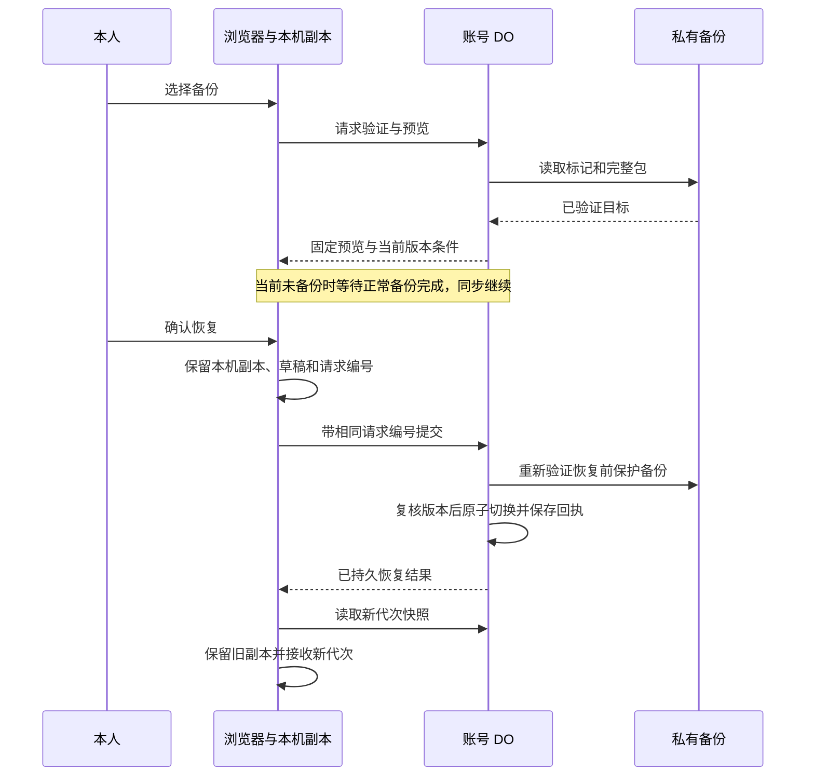

# 加油文档恢复设计

状态：**交付 A「代次兼容基础」已实施并通过本地验证（2026-10-05，隔离 worktree `feat/restore-generation-foundation`），尚未合并、未部署；交付 B「恢复操作」未实施**。六项产品取舍已由用户确认采用（2026-10-04）。本稿整理与复审基线为 `c6cf7b5f967ae36f1afb5796fe462fe4455efed2`；A 的实施基线为其后合并的 `59d7d6687664b8d0b49c4016398d90d697e0f853`（PR #17 文档补充）。

推荐实现本人账号内的整文档恢复：先验证所选备份并预览，确认当前服务端版本已有可读的保护备份，再以一次 SQLite 事务替换文档、切换代次、登记恢复结果与后续备份责任。设备按代次隔离副本，旧设备的记录和草稿保留供本人核对。

本文维护恢复设计及其接口变更。已上线的账号、同步、备份规则仍分别由[账号同步合同](./account-sync.md)、[独立备份合同](./backup.md)维护；发布事实见[备份发布记录](../releases/2026-10-04-independent-backup.md)。实施并验证后，再把已生效的协议与格式变更归入对应合同，本文保留恢复流程，避免维护两套规则。

## 1. 范围与成功标准

本次设计覆盖：

- 当前身份映射和备份序列完整时，列出最近备份、预览记录及变化、确认整文档恢复。
- 同步协议 v2、文档代次、本机副本及草稿保护、请求重复和中断处理。
- 备份格式兼容、跨代次最近 30 份衔接、恢复前保护和恢复后的独立备份。
- 私有 R2 的管理员离线验证，以及身份映射丢失或备份 blocked 时的人工处置边界。

完成标准：恢复成功后，当前文档是所选完整 Loro 快照；旧代次或缺代次的上传不能进入新文档；恢复前的服务端版本可从独立备份读回；响应丢失不产生第二次恢复；设备接收新文档前保留旧记录和草稿。失败时能判断是未切换、结果待确认，还是服务端已切换但本机接收失败。

本轮不包含字段历史浏览器、通用文件导入、批量恢复旧设备修改、跨账号迁移、全 DO/PITR 恢复、自动身份重绑定、AI、统计或依赖升级。字段纠正继续走普通编辑；[已确认的历史查看需求](./redesign.md#同步冲突与修改历史)仍为后续功能。

## 2. 沿用的前提与已确认取舍

沿用[备份合同 §12](./backup.md#12-恢复-pr-的前提本轮不实现)：整文档恢复使用新 `documentGeneration`；拒绝旧代次和缺代次上传；保护旧设备未同步副本；恢复前保存保护备份。继续保留完整 Loro 历史，复用当前 DO、私有 R2 Standard 与唯一 alarm；既有窗口、退避、blocked 和保留规则不重新选型。

以下六项取舍已由用户于 2026-10-04 确认采用：

| 已确认取舍 | 采用方案与理由 |
| --- | --- |
| 保护备份 | 复用精确覆盖当前服务端快照、且本次重新读回验证的已完成备份；有待备变化则等待正常备份。保护条件不满足时不提供跳过入口，避免无变化重复造备份或绕过退避。 |
| 并发同步 | 预览期间继续同步；确认时比较预览对应的代次、revision 和快照。发生变化则重新预览，不把几秒钟的 R2 读取变成业务写锁。 |
| 旧设备接入 | 明确提示代次变化，先保留旧副本，再由本人选择打开恢复后数据；提供只读核对和逐条填入普通表单的入口。 |
| 保留数量 | 一个账号的一个备份 stream 跨代次继续递增 revision，全部代次合计最近 30 份。保护备份、恢复后的基线均计入这 30 份。 |
| 发布顺序 | 先交付能理解新代次、格式和本机隔离的兼容版本 A，再交付恢复入口 B。A 可独立使用，也作为 B 的可用回退候选。 |
| 管理员权限 | 常规恢复只处理当前会话可证明归属的账号。离线验证可独立进行；映射修复、解除 blocked 与云端灾难恢复单独形成精确维护方案和执行授权。 |

最小路径就是上述流程，不增加任务队列、恢复期间的全账号写入租约或新的云端服务。锁住同步直至 R2 成功也能避免竞争，但故障时会阻塞正常编辑，不采用。直接导入旧快照继续原代次同步违反既有恢复前提，不作为候选。

## 3. 实读实现与外部依据

| 当前入口 | 与恢复有关的实读事实 |
| --- | --- |
| [sync-protocol.ts](../../src/shared/sync-protocol.ts)、[同步路由](../../src/worker/sync/routes.ts) | 当前只接受协议 `1`，没有代次头；完整快照上限 4 MiB。 |
| [AccountSync](../../src/worker/sync/account-sync.ts)、[AccountDocuments](../../src/worker/sync/account-documents.ts) | 会话复核、合并、备份责任在同一事务；主快照仅按账号分块。恢复不能复用 `merge()` 来替换文档。 |
| [local-refueling.ts](../../src/data/local-refueling.ts) | 账号数据库的 `documents/main` 保存快照、确认向量、待传状态和导入映射；写入使用 Web Lock 和严格 IndexedDB 事务。 |
| [refueling-sync.ts](../../src/data/refueling-sync.ts) | 迟到响应已有请求 epoch 防护，但所有 409 都触发会话重查，没有代次变化处理。请求 epoch 不是文档代次。 |
| [草稿会话](../../src/data/refueling-draft-session.ts)、[草稿判定](../../src/domain/refueling/draft-recovery.ts) | 草稿可能在隐藏窗口中继续落盘；已保存草稿会按当前记录判断并清理。因此旧代次草稿不能交给新代次的普通初始化逻辑。 |
| [备份引擎](../../src/worker/backup/backup-engine.ts)、[备份存储](../../src/worker/backup/backup-store.ts) | 冻结任务、保留责任和重试下限已持久化；`sourceGeneration` 目前在准备 manifest 时固定写为 legacy，捕获时尚未保存代次。 |
| [备份格式](../../src/worker/backup/backup-format.ts)、[验证器](../../src/worker/backup/backup-verify.ts) | 严格格式 v1；可复用完整包、历史和记录验证，但需增加以完成标记为信任起点的读取入口。 |
| [App.vue](../../src/App.vue)、[Vite 配置](../../vite.config.ts) | PWA 更新采用 prompt，已有“保存所有窗口输入后关闭重开”提示；没有强制刷新。 |

官方能力核查（2026-10-04）：

- Loro 完整 snapshot 包含操作历史和当前状态；`checkout` 是历史视图能力，不能替代应用层的整文档恢复与同步隔离。继续使用锁定的 `loro-crdt@1.16.3` 和现有严格验证器。[快照编码](https://loro.dev/docs/tutorial/encoding)、[历史查看](https://loro.dev/docs/tutorial/time_travel)。
- Cloudflare SQLite DO 支持事务和持久同步；PITR 作用于整个 DO 数据库，会连同身份、会话、备份元数据一起回退，不适合本人业务文档恢复。[SQLite 存储 API](https://developers.cloudflare.com/durable-objects/api/sqlite-storage-api/)。
- R2 提供强一致的对象操作及条件创建，但不能把 R2 与 DO 纳入同一提交。方案因此把外部读取和验证放在前面，把唯一的业务切换留在 DO 事务内。[R2 Workers API](https://developers.cloudflare.com/r2/api/workers/workers-api-reference/)。

另实读两个成熟实现，只借用机制，不引入依赖：

- [Automerge Repo `import`](https://github.com/automerge/automerge-repo/blob/b54e7a3f1da78769e4caa3f3f0d57a8840fcd983/packages/automerge-repo/src/Repo.ts)：已有文档 ID 的导入会合并，未指定 ID 时创建新 handle。借用“文档身份与二进制历史分开管理”的做法，Hako 在账号内用代次隔离同步。
- [CouchDB replication ID](https://github.com/apache/couchdb/blob/437a586f7c5aa4b03663a886bff7201b5b86b8a5/src/couch_replicator/src/couch_replicator_ids.erl)：同步身份计算有明确版本，并绑定端点信息。借用版本化协议身份的做法；这不是 CouchDB 已替 Hako 解决恢复竞争的证明。

## 4. 身份、版本与持久状态

### 4.1 四个标识分别承担职责

| 标识 | 拟议语义 |
| --- | --- |
| `accountId` | 会话解析的业务账号，恢复不改变它，不携带真实 issuer/subject。 |
| `documentGeneration` | 服务端生成的 UUID v4；每次整文档恢复创建新值，永不重新启用旧值。 |
| `backupStreamId` | 原备份序列保持不变；不能用它判断设备上传是否属于当前代次。 |
| `revision` | 沿用 `backup_cursor.current_revision`，账号内单调递增。恢复也占用一个新 revision，即使选中快照的历史向量更小；不以 Loro 向量给跨代次排序。 |

初次升级为已有文档生成初始代次 `G0`，并永久记录 `legacyGeneration = G0`。这是格式 v1 备份和旧正式账号本机库的唯一历史绑定。旧副本缺少代次时只能归于 G0，不能拿当前服务端代次补填。之后每次恢复生成 G1、G2 等新 UUID；这些符号只用于说明，不是实际 ID。

### 4.2 DO 增量状态

保留 `account_data_ids`、主快照表、会话及既有备份表；新增状态如下，不在 Loro 内加入管理字段：

| 表/扩展 | 字段与约束 |
| --- | --- |
| `refueling_document_heads` | 账号主键；当前代次、固定 legacy 代次、当前代次来源、切换时间。当前代次来源为 `initial` 或本节定义的 `restore` 引用。 |
| `refueling_snapshots` 扩展 | 增加可迁移的 `document_generation` 列；升级前分块为 null，升级时与 head 同事务绑定 G0。所有新写入必须显式列名、保存相同代次，读取时核对每块与 head 一致。用于发现 head 丢失、分块混代等残缺状态。 |
| `refueling_restore_previews` | 每账号最多一个；随机 `previewId`、选中备份引用、预期当前代次/revision/快照 SHA-256/历史摘要、目标 manifest 原字节、创建与过期时间。 |
| `refueling_restore_preview_chunks` | 以账号及分块号保存验证过的目标原始快照，分块沿用 512 KiB。目标上限仍为 4 MiB。与 preview 同事务替换或删除。 |
| `refueling_restore_receipts` | `(accountId, requestId)` 唯一；请求指纹、来源/保护备份引用、旧新代次、旧新 revision、提交时间。只保存成功切换回执，与切换同事务提交，不存业务字段或凭据；缺少回执不代表确定未执行。 |
| 冻结任务/完成缓存扩展 | 捕获时固定源代次、格式版本、代次来源；完成缓存保存对应信息、捕获时间、reason 及快照 SHA-256。旧缓存缺失的展示字段保持 null，不猜测、不为展示改写旧对象。既有冻结字节和已准备 manifest 不改写。 |

备份引用固定为 `backupStreamId + revision + bundleSha256`，不接受用户提供任意对象键或外部 URL。`restore` 来源固定保存 requestId、前一代次、目标备份引用与保护备份引用；每个新代次的后续备份沿用该来源，供离线读者识别恢复关系。引用的旧对象允许被正常最近 30 份策略裁剪，不能沿引用无限保留对象。

一份预览的有效期建议固定 **15 分钟**，不随轮询续期、不新增配置项。新预览可原子替换未消费预览，旧确认随即失效；尚在外部读取中的请求必须比较其开始时的 preview 版本，避免迟到覆盖较新预览。取消通过显式删除接口释放暂存；到期立即失去提交资格，暂存可在下一次预览写入时清理，不新增定时任务。

previewId 仅由服务端生成，持久成功后才返回；已删除、替换或消费的 ID 永不重新创建。恢复 POST 若以“预览过期”裁定请求确定未执行，须按 §7.3 在裁决事务内删除仍匹配的过期预览及暂存，使已经读走目标字节的在途请求也无法通过最终提交检查。

恢复回执长期保留少量元数据，不能按备份 30 份一起删除，否则迟到的同 requestId 可能再次执行。原始业务字节常态上限从主快照 + 冻结副本约 8 MiB，增加一份预览最多约 4 MiB；每账号最多约 12 MiB，另计元数据，不在 DO 累积每代完整主副本。

### 4.3 初始升级与状态丢失

版本 A 的构造阶段只做幂等 schema 增量，不把缺失元数据直接当作新账号或新代次。首次 v2 bootstrap 在短事务内检查已有身份映射、主分块和备份控制状态。所有分块仍为 legacy、没有现代代次痕迹且状态一致时，才创建 G0 并绑定原分块；无主文档/备份的干净新账号也可初始化。head 缺失但分块、冻结任务或完成缓存已带现代代次，或任何分块/映射残缺，都返回 `generation_state_unavailable`，不随机补建 G0。并发 bootstrap 复用已提交的同一个 G0。

初始化不等待 R2，也不改原始快照字节、revision 或已冻结任务，避免把 R2 故障变成正常同步的依赖。未升级的既有冻结任务按原格式完成；新捕获对有有效身份映射的账号调用同一事务级初始化规则，不凭当前内存代次改写旧任务。R2 序列/归属核对仍在备份生命周期与恢复预览中执行；发现无法解释的 v2 对象或未知前缀时保留对象并停止恢复，不把它们自动认领给刚生成的 G0。

代次、身份或备份状态发生带外回退不属于普通恢复。最脆弱的前提是这些控制状态仍能证明文档归属；分块标签能识别部分丢失，但整个 DO 回退到升级前会同时抹掉这些证据，不能承诺仅靠库内标记自动发现。因此任何 PITR/整库替换必须先在服务入口暂停写入，再按 §10 核对 R2 与身份后恢复服务；不得把带外回退当作普通 bootstrap。现有 blocked 下的有效同代次同步规则不变。

## 5. 同步协议 v2 与兼容版本 A

### 5.1 HTTP 合同增量

保留同源 Cookie、精确 Origin、4 MiB 限额、完整快照、持久确认和会话续期规则。新增接口及协议如下：

| 请求 | 输入与结果 |
| --- | --- |
| `POST /api/sync/refueling/bootstrap` | 空 JSON 对象；有效会话与 `X-Hako-Account`。幂等初始化/读取 G0 和当前代次，不接受业务快照，不执行恢复。无主文档时只建立代次元数据，首次正常同步仍负责创建空或非空业务文档与备份基线。 |
| `GET /api/sync/refueling` | 有效会话、账号及协议 2；只读当前完整快照。头部含账号、协议、当前代次及 `X-Hako-Revision`。没有主文档时返回 204，bootstrap 的代次信息仍有效。 |
| `POST /api/sync/refueling` | 协议 2；新增必填 `X-Hako-Document-Generation`，与会话账号和 DO 当前代次一起匹配后，才校验、合并和持久化快照。成功响应回传同一代次和已持久 revision。 |

bootstrap 返回 `accountId`、`documentGeneration`、`legacyGeneration`、当前代次来源、`snapshotAvailable` 和 `restoreWritesAvailable`，全部 `no-store`；它不从客户端上传内容推断代次，不返回身份字段。`restoreWritesAvailable` 表示当前应用版本是否提供恢复切换：A 为 false、B 为 true，不新增运行时开关；客户端仍以实际请求结果为准。备份游标尚未初始化时，读取接口的 `X-Hako-Revision` 为 `0`；这不是一个完成备份，不能用于恢复。所有 GET 都不创建映射或续期；写接口在实际事务点重新验证会话、当前配置 owner 与账号映射，不能使用请求初到时的旧时钟。

客户端先 bootstrap，再决定打开同代次本机副本或进入 §6 的保护流程。全新浏览器可 GET 当前快照建立本机副本；204 时在已知 G0 下创建合法空 Loro 文档，再正常交换。已有同代次副本走正常 CRDT 合并，不能先用 GET 覆盖本机待传数据。

版本 A 起统一拒绝协议 1 或缺少代次的业务上传：`426 protocol_upgrade_required`。格式错误代次为 400；合法但非当前代次为 `409 document_generation_changed`，附当前代次元数据，不附业务快照；账号不匹配仍为 `409 account_changed`。不得把请求头改成新代次后重发旧正文。

当前未更新的客户端会保留本机数据，但只能显示通用同步失败；它不会识别新的错误码或自动进入副本保护页。更新提示继续使用已有 PWA 流程，发布验收必须覆盖旧页面仍开着、新版本已就绪的情况，不强制刷新未保存表单。

### 5.2 合并点和客户端的检查

- 服务端检查代次、读取最新主文档、合并、更新 revision/备份责任及续期仍在同一个事务。旧上传先于恢复提交，则成为新当前版本并使预览失效；晚于恢复提交，则在合并前拒绝。
- 客户端一次交换绑定账号、文档代次和请求 epoch；检查响应协议、账号、代次及已发送版本覆盖后，才进入对应代次的本机写锁。
- 每次本机提交再次读取持久的 activeGeneration。已失活代次的迟到响应不能写入新代次或更新新代次确认游标。不能仅靠内存 epoch 或 BroadcastChannel。
- 401/`account_changed` 继续重查会话；`document_generation_changed` 进入副本保护流程；426 进入更新提示。代次不匹配不触发登录循环。
- 后台、离线及 bfcache 恢复沿用现有门禁。可编辑的离线旧副本回网后先核对代次，不自动上传到新代次。

## 6. 本机记录、草稿与旧设备

### 6.1 存储隔离与迁移

新版记录库建议为 `hako-account-v2:<accountId>:refueling`：`documents` 按 generation 保存完整快照、确认向量、待传标记、legacy 导入映射；`control` 保存 activeGeneration、待确认恢复 requestId 及其固定请求体、按 §7.5 持久确认的终态及原请求指纹，以及迁移来源指纹。代次切换与旧副本登记在同一严格 IndexedDB 事务内完成。A 已能保留并读取 B 使用的待确认/终态结构；普通保存、代次接收或升级不能把未知结果的请求清掉。

统一锁顺序为“旧 v1 文档锁（仅迁移读取需要）→ v2 账号控制锁 → v2 代次文档锁”，禁止反向嵌套。所有正式保存、远端确认落盘和代次切换都经过同一个账号控制锁；读 activeGeneration 与写 documents/control 在同一 IndexedDB 事务内，不能检查后另开事务写入。保持网络在锁外，草稿占用锁不作为代次切换必须夺取的锁。

草稿库使用 `hako-account-v2:<accountId>:<generation>:drafts`；Web Locks、BroadcastChannel 和 sessionStorage 线索同时带账号与代次。草稿格式和现有字段校验继续复用，旧草稿只在所属代次判断是否已保存。记录 ID 相同不能证明跨代次草稿已经保存。

旧正式账号 v1 库原样保留。迁移在旧文档 Web Lock 内读取，完整保留快照、确认信息、导入映射，只绑定 bootstrap 明确给出的 legacyGeneration：

- 目标 G0 尚不存在时，才允许把验证过的旧副本及其确认信息复制进 G0；当前仍为 G0 时再按协议 2 正常合并。迁移写失败则原库和新库原状态均保留。
- 当前已为其他代次时，将旧副本作为 G0 的保留副本，不上传，不把待传标记清零后宣称已同步。
- 旧标签页可能继续写 v1 库。新版在启动、回到前台及打开保留副本时，重新读取旧库并比较迁移指纹；发现新增历史时更新/合并到保留的 G0 副本，不能因“迁移完成”就永久忽略后续写入。G0 已失活时，这些变化仍不进入当前代次。
- 旧草稿不被新版占用、清理或删除；提供只读查看。迁入 G0 的编辑工作通过本人选择生成新草稿，不能抢占旧页面持有的草稿锁。
- 更早的 `hako-local-validation-v1` 及其草稿库仍按[账号同步合同](./account-sync.md#本机存储与首次接入)主动导入，不能与正式账号 v1 升级混为一谈。

G0 已存在时，必须在上述锁内读取最新 G0，把旧库新发现的历史合并进去，不能以旧快照替换它；保留 G0 现有确认向量，按合并后向量重算待传状态，不用 v1 的确认信息覆盖或推进 v2 确认。旧库来源指纹只在合并快照、待传状态和导入映射一起持久成功时推进；合并超限、校验或落盘失败均保留两份原数据与旧指纹，并显示待处理。导入映射按本节后述冲突规则合并，不能以旧映射覆盖新版新增条目。G0 已失活时也按此规则追加保留历史，但保持只读、停止上传，不改 activeGeneration。

新代次不继承旧代次的待传或确认游标；新确认向量来自已验证的当前服务端下载，和新快照在本机一起落盘后才报告接收成功。legacy 导入映射只继承本机已有映射中目标记录仍存在于新快照的条目；目标已不存在时允许本人重新选取旧验证记录，仍生成新 ID，不自动补回。多份保留映射对同来源指向多个仍存在的目标时标为需核对，禁止再次自动导入，不凭字段相似猜测。

### 6.2 发现代次变化后的操作顺序

1. 取消该副本的同步，冻结当前页面的保存按钮；在途本机事务仍归原代次，等待它落盘。
2. flush 当前表单草稿；失败则保留页面、输入和占用，显示存储失败，暂不切换本机工作区。其他隐藏/未响应窗口继续写自己的原代次草稿库。
3. 在账号控制锁内保存旧副本及其待传状态。网络请求不占这个锁。
4. 显示“账号数据已在另一处恢复。此设备原有记录和草稿已保留”，并给出“查看保留副本”“打开恢复后数据”。不要声称能精确列出所有未同步字段；当前只存确认向量，没有确认时的完整字段基线。
5. 本人选择后，GET 当前快照并验证。回到控制锁内，复核账号、目标代次、activeGeneration 和旧写入是否已收尾，再原子写入新副本并切换 activeGeneration。失败不覆盖旧副本，不显示已接收。
6. 新工作区按账号 + 代次装配；旧实例只读或隐藏，保留尚未结束的草稿写入和锁。BroadcastChannel 用于及时提示；每次保存时的持久代次检查才是防错边界。

若下载期间又发生一次恢复，服务端会返回更新的代次，重新展示提示；不能把任意晚到快照覆盖到已经打开的更晚代次。本机空间不足时停止切换，旧副本仍可读；不自动删除旧代次来腾空间。

### 6.3 如何处理保留的内容

保留副本只读显示记录、历史来源代次、待传状态和草稿，默认不勾选任何内容，不自动与新文档做 Loro 合并。

本人需要继续某项修改时：当前代次仍有同 ID 记录，逐项选取要带回的字段，使用**当前记录**作为普通编辑基线填入表单；记录已不存在时，明确“作为新记录填写”，分配新的记录 ID。草稿同样先核对原始输入，再填入当前表单。点击普通保存后才生成新的 Loro 操作并同步；保留副本继续保存。不能把旧 base 直接接到新表单，不能自动重放删除或批量复活旧记录。

## 7. 本人恢复流程

入口设在现有加油页的“备份与恢复”面板，继续使用现有登录门禁和页面导航。UI 不展示 DO、R2、请求 epoch 等实现术语；版本日期、记录数、变化范围、保护状态和本机未上传提醒用于帮助本人判断。

### 7.1 列表、预览与选择

列表只属于会话账号的现有 stream。按 revision 倒序展示最近 30 个完成版本，使用完成缓存的已确认摘要显示捕获时间、记录数、来源代次和恢复基线标签；旧缓存缺少捕获时间时显示明确标注的“备份完成时间”，其他未知项保持未知，不从上传时间反推业务提交时间。选中后从已验证 manifest 补全本次预览信息，不为列表展示一次加载 30 份完整历史。列表的历史验证状态不等于本次已完整读回，只有打开预览后才标记此次校验通过。

读取 R2 标记清单并核对完成缓存，分页必须完整；正常最多允许 31 个完成标记（清理中的临时状态），多出的未知序号、陌生 stream、缓存不一致或无法读全均不产生可确认列表。单页请求上限 32，遍历最多 32 页；到达读取上限时报告读取不完整，不能截断后声称已核对整个序列。清理中的版本不作为新的可选目标。

选择后读取精确标记和包，验证长度、格式、归属、整体/快照哈希、完整 Loro 导入、历史摘要和记录数，复用备份验证规则。目标快照暂存到唯一 preview，读取和哈希时不持有 DO 事务；保存 preview 前重新检查会话、当前主版本及预览替换条件。

浏览器分别读取预览目标和匹配预期代次/revision 的当前服务端快照，在独立只读 Loro 实例中比较。按稳定记录 ID 展示“将增加、将移除、字段不同、相同”的数量及逐条内容，复用统一业务字段清单；默认先显示有变化记录，其余按需展开。当前版本不再匹配时使预览失效。当前字段相同但历史不同不能标为完全无变化；目标历史及完整状态均相同则提示无需恢复，不生成新代次或备份。

暂存目标的用途是抵抗正常裁剪：若等待保护备份期间所选旧版本恰好被裁剪，已验证、仍有效的 preview 可以继续使用其固定字节；新请求不能再从已删除对象创建预览。暂存不是新成功备份，不占用 R2 的 30 份，也不保护原对象永不被裁剪。

### 7.2 保护备份与确认界面

发起设备先把已保存记录正常同步到服务端；有无法同步的本机修改时禁用本设备的最终确认，保留查看与重试入口。未保存表单只 flush 为草稿，明确它未进入云端保护备份。其他离线设备的内容不可能由本次保护备份覆盖。

满足以下条件后才显示可执行的最终确认：

- 主文档、代次及账号映射有效，preview 未过期且与当前版本一致。
- 备份状态没有 blocked、冻结任务、待备版本、保留检查、裁剪计划或尚未到期的失败下限。
- 最新完成版本精确覆盖当前代次和主文档；同代次/历史摘要不足以单独作执行授权，还需本次完整读回当前保护包。

存在待备变化时等待原 30 秒窗口及正常 alarm；不提前失败重试、不重置 `retry_floor_at`，也不单独启动第二个 R2 发布者。R2 故障或清理失败时同步继续，恢复保持不可确认；显示原因及实际下次尝试时间。若主文档与完成备份不一致但没有已登记责任，提示先完成正常同步/受控排查，不由只读预览重建游标。

确认界面显示选中版本、变化数量和保护版本，文案明确“这会替换账号当前的全部加油记录。其他设备原有修改会保留，之后需核对。此设备未保存的草稿不在云端备份中”。按钮为“恢复到此版本”；无需输入难以核对的哈希或手工复制编号。

### 7.3 确认请求与唯一切换事务

确认前，客户端再次 flush 草稿并等待本机保存；持久记录随机 requestId 和固定请求体后才发送。恢复 API 的处理顺序：

1. 重新鉴权、解析有界正文。查找同账号 requestId 的回执：指纹一致直接返回原结果，指纹不同返回 `request_id_conflict`；这个判断早于“当前代次已变化”检查。
2. 读取 preview 和当前主快照，完整验证暂存目标；记录此刻的当前快照字节，并确认 SHA-256、历史摘要、代次和 revision 与 preview 一致。读取或验证失败转入下述结果裁决，不直接返回“恢复未执行”。
3. 读取最新完成标记及保护包，完整校验；保护包的源代次必须对应当前代次，snapshot SHA-256 必须与当前持久主快照一致。旧格式 v1 只能按固定 legacyGeneration 解释。R2 返回错误、缺失或校验失败时，本次调用不进入切换，仍须裁决同 requestId 的整体结果。
4. 在既有 `storage.transaction()` 内重新鉴权并查重，然后比较当前代次、revision、previewId/期限，以及主表字节与步骤 2 读取的字节是否完全一致；复核备份空闲、保护完成记录与读回引用未改变。任一条件变化即整体拒绝。所有外部 I/O、异步哈希和 Loro 大对象分析均已在事务外完成。
5. 同一事务创建新 UUID 代次，用暂存的原始完整快照替换主分块，写入新代次来源；revision 加一；把同一快照冻结为该新 revision 的恢复基线；写入幂等回执并消费 preview；联合安排 alarm。任一 SQL 或 alarm 写入失败则全部回滚。
6. `await storage.sync()` 后返回成功；命中已有回执的成功路径同样遵守持久确认边界。客户端随后 GET 新代次文档并按 §6 接收；服务端成功与本机接收成功分开显示。

当前客户端已发出的正常同步可以与步骤 2、3 交错；步骤 4 的重新比较是最终裁决点。恢复专用替换操作不调用原 `merge()`，也不把“历史向量推进”当作恢复成功条件。

恢复基线在切换事务里冻结，确保随后新编辑不会把刚恢复的版本合并掉；初始化 `attemptCount = 0`、`nextAttemptAt = switchedAt + windowMs`，首次发布安排在切换后 30 秒，仍由唯一 alarm 推进。切换时待备区间为空，该 revision 由冻结任务承担；后续普通编辑另外登记待备责任，遵守既有优先级、重试和最多 31 份规则。恢复成功意味着新主文档已持久保存，不提前宣称新代次基线已经独立备份。

**请求结果裁决**覆盖同一账号、requestId 和固定请求正文，不能把一次 HTTP 调用的失败当作该请求的最终结果。三个结果为：

| `outcome` | 判定与客户端行为 |
| --- | --- |
| `committed` | 已有指纹一致的持久成功回执。返回原结果，客户端接收当前代次；其他调用的读取失败不覆盖该结果。 |
| `not_committed` | 同一裁决事务内确认无成功回执，并证明该固定请求已永久失去提交资格。客户端先持久保存该终态，才可解除本机待确认状态；本人重新预览和确认后使用新 ID，原 ID 不复用。 |
| `unknown` | 没有足够证据判定上述任一终态。保留原 ID、固定正文和旧副本，显示“结果待确认”；仅查询或重试原请求，不自动换 ID。 |

已完成鉴权和正文校验的失败出口，包括事务外 R2/快照校验失败、切换事务回滚及 `storage.sync()` 失败，都执行一次短裁决事务：重新鉴权，先按 requestId 查回执，指纹相同优先判定为 `committed`，不同则返回 `request_id_conflict`。查重之后才判断本次调用的错误；`committed` 和 `not_committed` 均须在事务结束且 `await storage.sync()` 成功后返回。裁决本身读取、写入或持久同步失败时保留 `unknown`，不能包装成确定未执行。事务外不缓存一次“无回执”查询作为后续错误响应的依据。

无回执时，只有以下持久条件可证明 `not_committed`：原 previewId 已不存在或被另一 ID 替换；或者有效、未回退的代次/单调 revision 已越过原预览绑定的版本。到期预览须在同一事务内删除匹配 ID 和暂存，再 `await storage.sync()` 后返回 `preview_expired` 的终态；删除失败则不作终态判断。所有在途请求最后都必须重新检查 previewId 和版本，不能仅凭提前读入内存的快照提交。单纯哈希不符、R2 故障、blocked、备份未就绪、会话失效或某次事务回滚都不是“永久失去资格”的证明；条件仍可执行或状态归属不可证明时返回 `unknown`。

这条判定复用成功回执和预览/版本条件，不新增失败回执表或恢复执行租约。`not_committed` 只针对响应绑定的固定正文；客户端不得用同一 ID 改换目标或条件。未通过鉴权、账号匹配或完整正文校验的错误不读取回执，也不提供请求终态；客户端仍保留原待确认请求，待恢复本人会话后查询。`request_id_conflict` 表示 ID 与正文不一致，应停止重发并核对，不能据此把另一正文的成功当作当前请求成功。

比如两个同 ID 请求都读到“无回执”，一个先成功提交，另一个随后读 R2 失败：后者的裁决必须读到已提交回执并返回成功。若失败调用先裁决且预览仍可执行，只能返回 `unknown`，另一个调用随后成功仍合法；若先在事务内移除了过期预览并确认无回执，则返回 `not_committed`，另一个调用也不能再提交。这三种顺序均需独立验收。

### 7.4 HTTP 接口与错误

以下均为拟新增接口，使用既有本人会话、账号匹配、`no-store`。写请求严格校验 Origin，JSON 流式限额 16 KiB；未知字段拒绝；snapshot 下载沿用 4 MiB 限额。previewId 和 requestId 均为 UUID v4，知道它们不能绕过账号授权。

| 请求 | 合同 |
| --- | --- |
| `GET /api/backups/refueling` | 已核对的版本元数据与当前代次；不初始化、不续期、不进行 R2 写删。 |
| `POST /api/restores/refueling/previews` | 输入精确备份引用；返回 previewId、期限、目标摘要、预期当前版本及保护等待原因。只能选择现有账号/stream，不接受上传包。 |
| `GET /api/restores/refueling/previews/{previewId}/snapshot` | 只读返回固定目标 snapshot 及其摘要；不能把此响应交给普通同步合并入口。 |
| `DELETE /api/restores/refueling/previews/{previewId}` | 只删除仍匹配且未消费的本账号 preview 和暂存；迟到取消不能删除较新预览或已完成回执。 |
| `POST /api/restores/refueling` | 固定输入：requestId、previewId、选中备份引用、expectedGeneration、expectedRevision、expectedSnapshotSha256。成功 200 返回 `outcome: committed`、旧新代次/revision、保护引用、提交时间及提交时新备份尚待完成状态。失败结果按 §7.3 裁决。 |
| `GET /api/restores/refueling/requests/{requestId}` | 只读查询已提交回执，存在返回 200 和 `outcome: committed`；不续期、不执行恢复或删除预览。不存在返回 404，这不证明另一个在途请求尚未或将不会提交，客户端按 `unknown` 处理。 |

请求指纹按上述固定字段顺序、无空白 JSON 的 SHA-256 计算；同 requestId 不能换 preview 或目标。v1 格式的 sourceGeneration 到 G0 的转换只发生在服务端已保存的 legacy 绑定上。

可用于结果确认的 POST 响应及 GET 成功回执都携带 requestId、`requestFingerprint` 和 `outcome`，沿用账号匹配响应头；客户端须核对账号、ID、固定正文指纹，才可落盘结果。`not_committed` 随裁决证明返回 409 `source_changed` / `preview_replaced` 或 410 `preview_expired`；其余已鉴权、可绑定正文的失败可沿用原错误码并携带 `outcome: unknown`。HTTP 状态或错误码本身不能决定终态；网络错误、格式不匹配、无 outcome、查询 404 和不能绑定到原请求的响应一律不清除待确认状态。相同请求一旦在本机确认终态，迟到的 `unknown` 或 404 不得把它降回待确认；相互矛盾的终态应保留证据并停止自动处理。

回执表示提交当时的固定结果；其中恢复基线“尚待完成”只描述提交时刻。当前备份进度另查状态接口，不能把多日后重放的回执当成实时备份状态。

等待备份时复用 `GET /api/backups/refueling/status`，增加当前/最近完成的有效代次字段；状态仍只是元数据，最终 POST 必须执行完整保护读回。仅面板可见且联网时沿用 30 秒轮询，不新增常驻后台轮询；关闭面板保留本机待确认 requestId。

错误码：401 `unauthorized`；403 `origin_not_allowed`；400 `invalid_request`；404 `backup_not_found` / `restore_request_not_found`；409 `account_changed`、`source_changed`、`preview_replaced`、`request_id_conflict`、`backup_not_ready`、`backup_blocked`；410 `preview_expired`；413 `body_too_large`；422 `backup_invalid` / `no_restore_change`；503 `restore_unavailable` / `generation_state_unavailable`。不返回业务内容、身份或底层异常作为错误信息。

### 7.5 中断、重复与失效

| 事件 | 结果与恢复方式 |
| --- | --- |
| 预览时退出、会话到期或账号改变 | 不保存新预览；已存在暂存不跨账号可见。最终确认仍重验会话。 |
| 保护备份失败、目标损坏、当前源改变 | 本次失败调用不切换主文档；同 ID 并发调用的结果须按 §7.3 裁决。保留正常备份责任，未得到终态前不改用新 ID。 |
| 事务内任一点失败 | 该事务的主快照、代次、回执、冻结任务与 alarm 一起回滚，随后裁决请求结果。不能用本次回滚否认另一个同 ID 调用已成功提交。 |
| 成功提交后响应丢失、请求超时 | 客户端显示“正在确认恢复结果”；查询并重发同 requestId 和同正文。不能自动换 ID。 |
| 两个请求恢复同一 preview | 同 ID 的成功结果由同一回执确定；仍可执行且尚无回执时允许返回 `unknown`。不同 ID 只有一个可通过版本条件，其余取得确定未执行结果后再重新预览。 |
| 已提交后客户端关闭或 IndexedDB 失败 | 服务端保持已恢复；本机旧副本和待确认 requestId 保留。重开查询回执，再接收新代次，不再次恢复。 |
| 保护验证后发生新同步或另一次恢复 | 事务复核拒绝旧确认。仅空交换、会话续期或读取不算业务版本变化。 |
| 关闭预览、停止轮询或浏览器断网 | 不会触发后台恢复；只有明确的 POST 可切换。已发出的 POST 可能仍提交；网络取消或 DELETE 预览成功不代替原 requestId 的结果裁决。 |

同一浏览器账号已有待确认请求时，所有标签页通过账号控制锁复用该 ID 和固定正文，不能用另一请求覆盖 `control`。处理响应时也须在锁内重查当前待确认记录，旧请求响应不能覆盖后来的请求。终态及原 ID/指纹先在严格 IndexedDB 事务内落盘；成功则进入新代次接收，确定未执行才允许本人重新确认新请求。`unknown` 只查询或重试原请求，关闭、重开或更新应用不自动清除它，也不自动执行一次新的恢复。

如需撤销一次已完成恢复，选择当次保护备份，再走相同流程生成另一个新代次；不能把当前代次指针改回旧值。

### 7.6 回退到 A 后的结果确认

A 必须提前支持相同的回执表、请求指纹和三个 outcome 的解释规则、`GET /api/restores/refueling/requests/{requestId}`、本机待确认/终态记录及新代次接收。A 的恢复 POST 只做鉴权、请求查重和回执读回：已有同指纹回执返回 `committed`，冲突返回 `request_id_conflict`，无回执返回 `503 restore_unavailable` 和 `outcome: unknown`，不执行切换或为判定终态删除预览；不得用路由不存在的 404 表示“恢复没发生”。这部分在 A 就交付，B 不能另引入 A 无法读取的回执或本机 schema。

成功响应丢失后回退 A，客户端仍先查询原 requestId。查到回执则显示已恢复并按 §6 接收当前代次；查不到时保留原请求和旧副本，显示“恢复暂不可用，结果尚待确认”，停止自动发送恢复 POST，正常同代次同步及代次变化处理继续。重新打开 B 后先再次查回执；仍无回执时由本人选择重试原请求，保持原 ID 和正文。预览过期或源变化也须取得 §7.3 的 `not_committed` 裁决并在本机落盘，才允许重新预览确认并使用新 ID。仅查询得到 404、关闭页面或版本回退都不能作为清除待确认记录、换新 ID 或宣称已撤销的依据。

## 8. 备份格式与跨代次保留

格式 v1 对象、完成标记、键和哈希原样保留。新增格式 v2：魔数 `HAKOBK2\n`，其余二进制长度结构与上限沿用；manifest 和 marker 的 `formatVersion` 均为 2，必须彼此匹配。对象布局仍为 `layout-v1`，继续使用原 stream 和全局递增 revision；布局版本和包格式版本分开。

v2 manifest 保留原业务校验和长度/摘要字段，明确变更：

- `sourceGeneration` 为 `{ kind: document-generation-v1, id: <UUID v4> }`，`syncProtocol` 为 2。
- `generationOrigin` 为 §4 的固定 `initial` 或 `restore` 来源；新代次后续普通备份不丢失这段来源。
- `reason` 接受既有 `baseline`、`history-change`，新增 `restore-baseline`，仅用于切换事务冻结的首份恢复快照。

解析器显式区分 v1/v2，不放宽 v1 的严格字段校验，不根据账号 ID 猜测现代代次。新任务在捕获时保存格式及代次；升级前已冻结但未准备 manifest 的任务继续用其 legacy 来源生成 v1；已准备任务沿用原 manifest 字节。不能在重试时读取当前代次来给旧快照贴新标签。

备份覆盖判断改为有效源代次与历史摘要匹配；恢复的保护判断另外要求本次包读回及快照哈希匹配。不同代次即使历史摘要相同也不能互相确认覆盖。新代次冻结、完成确认、覆盖补登记及共享 alarm 均需要携带/比较代次，不能出现旧任务确认清掉新代次待备责任。

保留仍按同 stream 的 revision 排序，全部代次合计最近 30 份，保留检查和精确删除计划沿用既有合同。format v1/v2 混合序列也必须完整镜像核对；触发裁剪前按各自格式验证全部应保留对象。保护备份不获得永久 pin；后续成功备份达到保留边界时可被裁剪，UI 不承诺无限期撤销恢复。

当前新代次保留所选快照内的全部历史；被恢复跳过的较新旧历史留在旧备份和设备保留副本中，受各自保留边界约束。不能宣称它已经合并进新代次，也不能为找回旧历史直接导入旧代次完整快照。

## 9. 代价、故障和可回退性

- **外部依赖失败**：R2 读取、备份发布或清理不可用时，普通同步继续；恢复停止在确认前。身份服务不可用时沿用会话政策，不增加另一套登录凭据。
- **持续并发编辑**：预览可能反复失效。本产品是低频个人记录，默认选择重新预览；UI 提示先完成其他设备编辑。若真实使用证明无法取得稳定窗口，再另行评估短维护窗口，不预先引入锁租约。
- **十倍数据量**：已有完整历史 4 MiB 限额先成为边界，不放宽、压缩或截历史绕过。列表不同时加载 30 个业务快照；目标/当前解析只处理有界快照，UI 分页渲染。临近上限必须做本地 workerd CPU/内存及浏览器验证，不能用总记录数推算一定可用。
- **本机保留空间**：旧代次不自动删除，恢复次数增加会占用浏览器空间。空间不足时停止本机接收，保留原副本；历史副本清理需单独由本人操作设计，首版不提供自动回收。
- **回退**：B 可回到已验的 A，因为 A 同样支持新代次、格式 v2、恢复基线任务、旧副本隔离和 §7.6 的结果确认。回退后保留回执读取，停止新的恢复切换，不能撤销已提交数据。A 上线后，不把任何协议 1 的历史 Worker 当作安全回退目标；首次代次初始化前后均按兼容发布计划核实。整文档撤销使用新的恢复操作。

常规恢复新增云端服务、Secret、账号和可调参数均为 **0**。仍使用既有会话、`HAKO_ACCOUNT` 和 `HAKO_BACKUPS`。恢复前读取会增加 R2 GET/LIST 与 SQL 成本；原合同的本地计量样本不能作为恢复费用。实施时分别记录列表、预览、保护验证、切换和后续基线的实际计量，不把并发同步混入恢复归因。

## 10. 管理员离线验证与身份映射丢失

### 10.1 独立离线验证工具

实施 B 时交付一个不联网的 `backup:verify` 命令，输入为已下载的完成标记和其精确包，以及操作者指定的预期环境、账号、stream、revision；复用同一 v1/v2 解析和验证函数，不另写一份宽松解析器。命令拒绝 URL 输入，不包含云端写能力。

拟定调用接口为 `pnpm run backup:verify -- --marker <本地标记文件> --bundle <本地包文件> --environment production --account-id <账号UUID> --stream-id <序列UUID> --revision <整数>`。尖括号表示操作者必须提供的具体输入，不使用仓库内真实身份或默认生产对象。默认仅输出版本、代次、记录数、字节数、哈希及通过/失败；成功退出 0，验证失败退出非 0，不打印业务字段。实现以锁定的 Node 24 和现有 Vite/Rolldown 打包能力运行共享验证代码，不新增包或重新实现 Loro。

读回流程：授权管理员只读列出私有桶完成标记 → 选择精确标记与其声明的包 → 在受控本机目录下载 → 运行离线验证 → 在另一个全新 Loro 文档导入并核对报告。不能因有孤立 `.hakobak` 就当作完成备份；不能用文件名代替包内归属与哈希交叉核对。原始文件包含本人业务数据，不进入仓库、日志或对话；若需保留或删除本机导出，由本次实际操作范围决定。

正常预览不依赖这条管理员下载路径。R2 的读取凭据只需当前精确桶的读权限；复用已有管理员凭据，不创建持久 S3 Key，不把 Cookie 或 Token 写入命令文本、报告和文件名。

### 10.2 归属不再可证明时

普通恢复遇到映射缺失、代次缺失、未知 stream 或 blocked 时停止写入/删除并保留对象。已有有效映射下的正常同步继续遵守原 blocked 合同；不能靠清空备份游标、删除冲突对象或重建随机账号解除问题。

受控处置必须形成具体事件计划：

1. 核对仍有效的 owner 配置和既有身份来源；只读清点全部映射、主文档、代次、备份缓存及 R2 对象。不能从备份中的 accountId 反推出 issuer/subject，也不能把普通登录当成孤儿数据的认领证明。
2. 离线验证候选包，结合原发布/验收回执与操作者提供的归属证据，明确“当前身份将绑定哪个原 accountId/stream”；归属有歧义就保留并停止。涉及秘密时只在受控运行时比对，不输出值。
3. 形成精确修复候选，记录预期当前状态、目标映射、目标备份哈希、新代次与退出维护的方法。云端执行需另行授权；正常产品不增加可任意指定账号的 HTTP 重绑定端点。
4. 获准后先冻结相关写入口和备份调度，保留原状态与所有可读业务副本；无法保存当前主数据时，不使用普通恢复的“已有保护备份”承诺，必须把缺失项列为事件风险供用户明确决定。
5. 仅在全部预期状态仍匹配时修复映射与元数据；从完整标记集合重建可解释的序列镜像，采用大于已验证序列上界的后续 revision 和全新文档代次。发现未知对象或更高不可解释序号继续停止。重绑定不得改变包内原始归属或伪造旧包。
6. 验证目标独立可读、旧上传被拒绝、新同步持久确认及新备份可读后，再按事件计划恢复调度和受控解除 blocked。旧客户端、本机副本及身份/会话的处理分别核验。

上述是人工维护的执行约束，不授权本轮进行云端修复。首版交付离线工具、正常恢复接口和该处置流程；具体故障的临时维护候选取决于实读损坏范围，由事件执行者在对应授权下准备，不提供通用“修复所有状态”按钮。

## 11. 实施划分与代码入口

预计改动明显超过 8 个文件，涉及协议、DO/备份、本机记录/草稿和页面四部分；风险集中在代次隔离与跨存储事务边界。按两个可独立使用的交付划分，不把调查或未解决选择包装成实施阶段：

| 交付 | 内容与独立可用性 |
| --- | --- |
| A：代次兼容基础 | 协议 v2、受控 G0 升级、拒绝 v1 上传、GET 快照、本机 v2/旧副本保护、v1/v2 备份格式和捕获代次、恢复基线 reason 的消费能力；提前支持回执表/请求格式、三个结果分类、结果查询、仅查重的恢复 POST 与本机待确认/终态处理。没有恢复切换能力，日常记录/同步/备份可用；也能消费 B 留下的新代次、冻结任务和未知结果请求。 |
| B：恢复操作 | 备份列表、固定预览、保护校验、幂等切换、恢复 UI、离线验证工具；复用 A 的安全边界。B 暂缓时 A 仍是完整可用应用。 |

拟修改现有入口：`src/shared/sync-protocol.ts`、`src/worker/sync/`、`src/worker/auth/account-rpc.ts`、`src/worker/account-durable-object.ts`、`src/worker/api.ts`、`src/worker/backup/`、`src/data/account-storage.ts`、`local-refueling.ts`、`refueling-sync.ts`、草稿相关模块、`useLocalRefueling.ts`、`useRefuelingDrafts.ts`、账号/加油工作区组件与 `App.vue`。

拟新增 `src/shared/restore-protocol.ts`（接口与固定错误码）、`src/worker/restore/restore-store.ts`、`restore-service.ts`、`routes.ts`、`src/data/refueling-restore.ts` 和 `BackupRestore.vue`、`RetainedRefuelingCopy.vue`。纯验证逻辑继续归 `backup/`；正常同步不依赖恢复 UI。离线 CLI 放 `scripts/`，用一个 `package.json` 脚本暴露，不增加云端绑定。

A 实施时同步更新账号同步合同和备份格式合同；B 实施时把本稿中已批准且实测的恢复规则转为正式合同。发布记录只有实际发布后才写“已部署”。Git/PR 标题继续英文，当前设计稿不产生提交、推送或部署授权。

## 12. 验收路径

### 12.1 A：协议、迁移和设备隔离

| 验收组 | 必须证明 |
| --- | --- |
| 升级 | 已有 legacy 文档、空账号、重复/并发 bootstrap；有效旧历史及导入映射完整；G0 稳定；R2 断连不阻塞正常升级/同步；已有现代分块或任务却缺 head 时停止初始化，R2 的不可解释 v2 对象不得被恢复入口认领。 |
| 协议 | 缺代次、旧代次、非法代次、错误账号、过期/已撤销会话、正文读取中退出全部在合并前拒绝；授权的同代次完整快照仍正常收敛。 |
| 本机迁移 | 写失败不丢旧库；G0 已有 v2 未同步编辑时再次读取 v1，只合并新增历史，不覆盖快照/确认信息/新增导入映射；合并超限或写失败不推进指纹；迁移后旧标签页继续写入仍可发现；当前已恢复时旧库只归 G0，不贴新代次上传。 |
| 本机竞争 | 同账号多个标签页、不同账号、响应乱序、bfcache、离线编辑、切换中 IndexedDB abort/配额不足、BroadcastChannel 缺失；都不能跨代次写入或误确认。 |
| 草稿 | 隐藏/未响应旧窗口、未结束写入、占用锁、孤儿编辑草稿、同 ID 不同代次记录；旧草稿不被新代次清理或自动保存。 |
| 格式与引擎 | 冻结时固定代次；v1 原字节重试；v1/v2 混合列表、确认和裁剪；不同代次相同历史不误报覆盖；持久下限和共享 alarm 仍成立。 |
| 回退兼容基础 | 用合成 B 状态验证 A 可读取回执、本机待确认/终态记录和当前代次；已有回执只读返回 `committed`，无回执的恢复 POST 返回暂不可用及 `unknown`，零切换且不删除预览；查询 404 不触发新 ID 或删除待确认记录。 |

### 12.2 B：恢复及故障

| 验收组 | 必须证明 |
| --- | --- |
| 正常恢复 | 空快照、非空快照、并发 Loro 历史、曾删除记录和临近 4 MiB 快照；值、原记录 ID、历史摘要、目标哈希符合所选备份。 |
| 预览 | 标记/包不匹配、损坏、未知字段/格式、错误归属、缺包、过期、另窗口替换；预览期间目标被正常裁剪，固定暂存仍可用于已确认的同一目标。 |
| 保护门禁 | R2 GET/LIST 失败、备份重试/blocked、清理未完成、摘要匹配但快照哈希不符；失败调用不执行切换，同 ID 请求结果按回执和持久条件裁决；不提前备份重试、不新增第二个 R2 发布者。 |
| 并发边界 | 确认前及保护读取期间的新编辑使确认失效；事务前提交的旧上传进入保护范围，事务后到达的旧上传被拒；空交换不造成无谓版本变更。 |
| 原子性 | 主分块、代次、revision、冻结任务、回执、消费 preview、setAlarm 每个写入位置故障均整体回滚。 |
| 幂等与重启 | 同 requestId 并发/重复、不同正文复用 ID、提交后丢响应、`storage.sync()` 失败、真实 workerd SIGKILL 后同 persistDir 重启；最多一次代次切换。 |
| 失败结果裁决 | 同 ID 两个调用均通过入口查重后，分别覆盖“成功提交先于另一次 R2 失败”“失败先返回 unknown、另一次随后提交”“过期预览先被原子移除、迟到调用被拒”；SQL/持久同步故障不伪造终态，会话失效不泄露回执，哈希不符但版本未推进不单独判定终态。 |
| 终态与本机竞争 | 两标签页不能覆盖未决请求；校验账号/ID/正文指纹，unknown、404 和迟到响应不清除请求或覆盖已确认终态；终态落盘失败仍保留原 ID；只有持久成功或确定未执行后才能结束待确认，新的恢复仍需本人确认。 |
| 界面与本机 | 服务端已成功但本机失败；重开查回执后接收；旧草稿/保留记录填入当前表单仅在本人保存后进入新代次。 |
| B → A → B | 在 B 提交前/提交后丢响应两条路径回退到精确 A 产物，验证真实回执查询、旧副本保留、恢复写入停止；再上 B 先查结果，未提交请求只经本人选择以原 ID 重试。 |
| 跨代保留 | 多次恢复、恢复基线后新编辑、混合格式累计 30/31 份、各删除阶段中断；无第 32 份失控发布，不永久 pin、不自动按代次另留 30 份。 |
| 独立恢复材料 | 移除合成 DO SQLite，仅用 R2 标记和包完成离线验证；缺少身份映射时不能因此授权云端绑定。 |

基于现有测试扩展 `worker-sync`、`local-account-storage`、`refueling-sync`、草稿、备份格式/引擎和路由覆盖；新增 `worker-restore.test.ts`、`refueling-restore.test.ts`、`tests/integration/restore-workerd.test.ts`。跨事务、R2 故障和重启使用现有真实 workerd harness；浏览器锁/PWA/草稿交互另做两个独立浏览器上下文及真实目标设备验收，不用 fake IndexedDB 结果代替真机。

实施验证使用现有 `pnpm exec vitest run <相关测试路径>`、`pnpm run test`、`pnpm run typecheck`、`pnpm run build`；发布前对精确产物执行 `pnpm exec cf deploy --prebuilt --dry-run --mode production`。新增工具用合成 v1/v2 标记与包验证成功/失败退出码和无业务字段输出。按实际变更和发布门禁选择检查，不预先规定新增测试数量，也不在本轮重跑已关闭的 300 项验收。

### 12.3 发布与人工接受

A/B 各自冻结候选并审阅；发布属于后续操作。A 先验证旧客户端保留数据并能经正常更新进入 v2、既有真实备份仍可读；B 发布前必须用本地隔离持久数据完成 §12.2 的 B → A → B 验证，再把支持 v2 和结果确认的精确 A 版本列为可用回退候选。

B 的生产检查先做有界只读列表与包验证；产品的 POST 预览会在 DO 写入暂存，必须明确区分于纯只读验收，并纳入当次上线验收范围。真实恢复必须另选明确目标，由用户了解记录变化与保护备份后主动执行；不代用户编辑业务记录、制造 31 份备份或删除生产对象做测试。测试期间仅记录必要的 revision、代次、计数、哈希和结果，不保存业务字段或 Cookie。

## 13. 本轮设计验证记录

本稿依据上述基线的合同、实现、已有测试入口和 2026-10-04 可达的官方文档/源码整理。仓库与 GitHub 只读查询已执行；现有 Worker/R2 绑定从配置与发布记录确认，本轮没有重新探测生产存储或凭据。

2026-10-04 内容复审以初稿 SHA-256 `049119967c116e7edd70a4cda2ab3852dca65894f17b4ab67ef8fca5bde6b3b3` 为起点，对照当前本机持久化、同步、备份事务与合同，修正两处设计缺口：

| 发现 | 触发与影响 | 文档修正及实施验收 |
| --- | --- | --- |
| P1：再次迁移可能覆盖 G0 新编辑 | v2 已保存尚未上传的新历史，旧标签页又写 v1；初稿“复制进 G0”未限制目标为空，照此替换会丢失 v2 独有修改或确认状态。 | §6.1 明确首次复制与后续合并、确认向量和指纹的原子更新规则；§12.1 增加双库竞争、合并超限与失败检查。 |
| P2：回退候选缺少未知结果处理 | B 已切换但响应丢失，回退只有同步/备份能力的 A；初稿未要求 A 提供回执接口和本机待确认处理，无法兑现重开后确认结果的承诺。 | §7.6 和 A 交付范围补齐只读确认路径；§12 增加提交前/后丢响应及 B → A → B 场景，未实测前不能称 A 为已验证回退目标。 |

上述两项已在设计文本中修正；这是同一 Agent 的内容复审，未执行独立 Agent 审核或实现测试。该次复审未发现其他需阻止设计稿入库的问题；§2 的新增产品取舍当时尚待用户确认，文档入库不等于批准实施。

前一轮只修改设计文档和入口链接；已检查 3 份文档中的 57 个本地链接/锚点，全部通过，并检查变更边界与空白格式。当时本机工具实读为 Node `v24.18.0`、pnpm `11.25.0`。

2026-10-04 后续就绪检查发现：同 requestId 的一次调用已经提交，另一次在事务外失败时，原稿未要求错误出口重新裁决，可能误报整体失败。此次补充基于已合并文档 `67095267`，在 §7.3 明确成功回执优先、确定未执行所需的持久条件和 unknown 保留；同步补齐响应绑定、本机终态、A 回退和 §12 的三种并发时序验收。该次补充仅修改本设计稿，§2 六项新增取舍当时尚待用户确认。

本次补充已核对请求裁决、HTTP 响应、本机存储与 A/B 回退的对应规则；20 个本地链接/锚点、22 处章节引用、代码围栏、标点和差异空白检查均通过。未编写恢复代码，未执行应用测试、构建、云端读回、真实恢复或发布。任何实现能力、CPU/内存表现、计量与真机结果都需要按 §12 取得新证据。

2026-10-04 用户确认采用 §2 的全部六项取舍，当前设计已无该批待确认项。此次仅更新决定及文档入口状态，恢复实施与发布尚未开始。

2026-10-05 交付 A「代次兼容基础」在隔离 worktree 实施（分支 `feat/restore-generation-foundation`，基线 `59d7d668`）并完成本地验证：协议 2（bootstrap/GET/POST、426/409/503 语义）、受控 G0 升级与分块代次标签、本机 v2 副本与迁移合并/代次切换/保留副本、v1/v2 备份双格式与捕获代次、恢复回执表/请求指纹/只查重 POST/回执 GET 与本机待确认/终态结构。实现范围、验证命令与结果、未验边界统一由[本地验证进展](../local-validation.md#恢复代次兼容基础a2026-10-05隔离-worktree未部署)的新节维护；本文规则不变，协议与格式增量已按单一事实来源并入[账号同步合同](./account-sync.md)与[备份合同](./backup.md)。恢复切换（预览、保护校验、幂等切换事务与 UI）与离线验证工具仍属交付 B，未实施；A 未部署，未写真实云端业务数据。
